# Software Design Document (SDD)
## AI-Powered Indian Food Calorie & Nutrition Tracker (Android + iOS)

| Field | Value |
|---|---|
| Document status | Draft v1.1 (scope-control revision) for Phase 0 approval |
| Product codename | **NutriLens** *(placeholder name; rename freely)* |
| Platforms | Android, iOS (Flutter) |
| Backend | Python / FastAPI (modular monolith for V1) |
| Core principle | **Build the food-recognition and nutrition-estimation core first. Personalization comes only after the core is reliable.** |

### How to read this document

Every design statement is tagged with one of the following status labels. Please never treat a **Proposed** or **TBV** item as final.

| Label | Meaning |
|---|---|
| **[CONFIRMED]** | Decided by product requirements. Changing it needs a formal change request. |
| **[PROPOSED]** | Recommended design with reasoning. Expected to hold unless experiments disprove it. |
| **[ASSUMPTION]** | Technical assumption that must be checked during implementation. |
| **[TBV]** | To Be Validated. Needs an experiment or benchmark before commitment. |
| **[OPEN]** | Open question. Needs a decision (listed again in Section 39). |
| **[FUTURE]** | Documented but explicitly out of scope for the core phases. |

### Revision 1.1: summary of changes

This revision applies targeted corrections only. The architecture, phase sequence (0-11) and technology stack are unchanged except where listed.

| # | Change | Main sections |
|---|---|---|
| R1 | **Food Identity Resolution** layer added between classification and portion estimation; the classifier outputs *visual classes* and never selects a nutrition record | 1, 9, 10, 11, 13, 14, 16, **16A**, 18, 19, 20, 21, 22, 24, 33, 35, ADR-009, App. B |
| R2 | 95-98% is no longer a blanket target; it is a long-term *aspiration* for slice-defined food-recognition only. Evaluation is per component and per slice | 4, 16, 26 (26.2, **26.6-26.8**) |
| R3 | Initial class set is **small, high-quality and data-driven (size TBV)**; 150-300 classes is no longer assumed. Visual labelset and identity map are versioned | 19, 24, 33, 36, 39, ADR-011 |
| R4 | **Segmentation is optional / experimental (TBV)**; Phase 4 includes a detection-only vs detection+segmentation ablation | 9, 14, 15, 17, 33 (Phase 4), ADR-010 |
| R5 | Nutrition model strengthened: visual identity -> canonical food -> variant -> preparation/recipe -> ingredients -> nutrition profile; variant selection and correction | 8, 18, 19, 22 |
| R6 | MLflow, DVC, Redis, TensorRT and async queues are **optional, phase-dependent, introduced only after measurable need** | 13, 20, 25, 31, **32.1** |
| R7-R9 | V1/MVP vs Future separation; deferred feature register (A-N); version roadmap (V1 / V2 / V3+) | 4, 36, 37 |
| R10 | Scope-control principle added | **3.3**, 40 |
| R11 | Consistency pass across all sections | all |

### Table of Contents

1. Executive Summary
2. Problem Statement
3. Product Vision
4. Goals and Non-Goals
5. Functional Requirements
6. Non-Functional Requirements
7. User Personas
8. User Workflows
9. System Workflow
10. High-Level Architecture
11. Detailed Architecture
12. Mobile Architecture
13. Backend Architecture
14. AI/ML Architecture
15. Food Detection Design
16. Food Classification Design
16A. Food Identity Resolution Design
17. Portion Estimation Design
18. Nutrition Engine
19. Nutrition Database
20. Data Architecture
21. API Design
22. Database Schema
23. Feedback / Correction System
24. ML Data Pipeline
25. Model Training Pipeline
26. Model Evaluation
27. Error Handling
28. Security and Privacy
29. Performance
30. Testing Strategy
31. Deployment Architecture
32. Technology Stack
33. Phase-wise Development Plan
34. Phase Dependencies
35. Phase Completion Criteria and Phase Gates
36. MVP Definition
37. Future Roadmap
38. Risks and Mitigation
39. Open Technical Questions
40. Final Implementation Guidelines
- Appendix A: Architectural Decision Records (ADR-001 to ADR-011)
- Appendix B: Implementation Order (Build First, Second, Third...)

---

# 1. Executive Summary

NutriLens is a mobile application where a user photographs a meal (especially Indian food), and the system:

1. Detects each food item in the photo
2. Identifies each item (for example "Dal Tadka", "Roti", "Jeera Rice")
3. Estimates the quantity of each item
4. Resolves each visual result to a canonical food identity and variant (**Food Identity Resolution**), then maps (food + variant + quantity) to a curated nutrition database
5. Shows calories, macros and selected micronutrients **with confidence indicators**
6. Lets the user **verify and correct** anything the AI got wrong
7. Saves the confirmed meal to a nutrition diary with daily totals

**[CONFIRMED]** The system is a *pipeline of separate modules*, not one end-to-end model that outputs calories from pixels:

```text
Image → Food detection → Food classification (visual class) → Food Identity Resolution (canonical food + variant) → Portion estimation → Nutrition database → Nutrition calculation
```

**[CONFIRMED]** Output is always presented as an **estimate**, never as a laboratory measurement. Prediction + Confidence + User Verification + Correction is the core interaction contract.

**[PROPOSED]** The V1 architecture is a **Flutter** app talking to a **FastAPI modular monolith** with a **PostgreSQL** database, S3-compatible object storage, and a **PyTorch**-trained, ONNX-exported ML pipeline served server-side. On-device inference is evaluated in Phase 10, not before. MLflow, DVC, Redis, TensorRT and async queues are **optional and introduced only after measurable need** (Section 32.1), and segmentation is **experimental** until the Phase 4 ablation justifies it.

**[CONFIRMED]** Development is strictly **phased (Phase 0 to Phase 11)** with a Phase Gate at the end of each phase. No phase may silently implement the functionality of a later phase.

---

# 2. Problem Statement

## 2.1 The user problem
People who want to track food intake face three frictions:

- **Logging effort.** Searching a database and typing every item of every meal is tedious, so people quit within days.
- **Indian food coverage.** Most global apps are weak on Indian dishes: wrong names, wrong serving units (katori, roti, glass), generic Western recipes, missing regional variants.
- **Portion ambiguity.** "1 bowl of dal" can mean 100 g or 250 g, and users cannot judge it reliably.

## 2.2 The technical problem
Estimating nutrition from one photograph is hard because:

| Challenge | Why it is hard |
|---|---|
| Visual similarity | Many Indian dishes look alike (Paneer Butter Masala vs Shahi Paneer vs Kadai Paneer; different dals). |
| Mixed dishes | Biryani, khichdi, pulao hide ingredients inside rice. |
| Hidden ingredients | Oil, ghee, butter, sugar, salt, cream cannot be seen. |
| Recipe variance | Home vs restaurant vs regional versions differ by 30-100%+ in calories. |
| Portion from 2D | Weight in grams cannot be exactly derived from a single RGB image. |
| Thali / multi-food | Many touching items, small bowls (katori), overlapping foods. |
| Capture variance | Lighting, angle, plates, steel vs ceramic, phone cameras. |

## 2.3 The consequence for design
Because of the above, the system **cannot promise exact calories**. It must be designed around **estimation with confidence + cheap user correction**, and it must improve over time using validated corrections.

---

# 3. Product Vision

> *A user should be able to point the phone at a typical Indian meal, get a trustworthy, editable nutrition estimate in a few seconds, and save it in under 15 seconds of total interaction.*

## 3.1 Vision in two stages

```text
Simple V1                                Advanced System (long-term)
Food photo                               Food Image
 ↓                                        ↓ Detection
Food recognition                          ↓ Segmentation
 ↓                                        ↓ Classification
Quantity                                  ↓ Portion Estimation
 ↓                                        ↓ Recipe / Ingredient Understanding
Calories                                  ↓ Nutrition Engine
                                          ↓ Confidence
                                          ↓ User Verification
                                          ↓ Personalized Nutrition
                                          ↓ Continuous Model Improvement
```

**[CONFIRMED]** The architecture must allow this evolution **without rewriting the application**. This is enforced through: replaceable ML modules behind stable interfaces, versioned data and models, clear API contracts, and a nutrition engine that is independent from computer vision.

## 3.2 Design pillars

1. **Modularity.** Each pipeline stage has its own interface, tests, metrics, and model version.
2. **Honesty.** Estimates, ranges, and confidence are shown, not fake precision.
3. **Correctability.** Correcting the AI must be faster than logging manually.
4. **Data flywheel (controlled).** Corrections feed a reviewed pipeline, never raw auto-training.
5. **Observability.** Every prediction is traceable to model versions and data versions.
6. **Privacy by default.** Minimal data, bounded image retention, user-controlled deletion.

## 3.3 Scope-control principle **[CONFIRMED]**

> **Do not build advanced intelligence on top of an unreliable food-recognition and portion-estimation foundation.**

Implementation priority, in order:

1. Food recognition
2. Food Identity Resolution
3. Portion estimation
4. Nutrition calculation
5. User verification / correction
6. Meal storage and daily tracking
7. Measurement and evaluation
8. Reliability improvement
9. Only then: personalization and advanced intelligence

The project optimizes for a **trustworthy core system before feature breadth**. Anything outside the V1/MVP list in Section 36 is tagged [FUTURE], [NEXT VERSION], [POST-MVP] or [TBV] and is not a current requirement.

---

# 4. Goals and Non-Goals

## 4.1 Goals

| ID | Goal | Measure |
|---|---|---|
| G1 | Reliable Indian food recognition | Slice-based targets (Section 26.2 and 26.6). **95-98% Top-1 is a long-term aspiration** for appropriately defined recognition slices, retained only if benchmark results support it. It is **not** an overall-system, portion or calorie accuracy target. |
| G2 | Multi-food detection | Detect all major items on a plate/thali (targets in Section 26). |
| G3 | Useful portion estimates | Median portion error target defined per phase (Section 17 and 26). |
| G4 | Defensible nutrition numbers | Every nutrient value traceable to a source (provenance). |
| G5 | Fast correction | Median time to fix a wrong item is under 10 seconds (**[TBV]** via UX testing). |
| G6 | Modular, replaceable ML | Any model swapped without API change. |
| G7 | Production readiness | Security, monitoring, privacy, backups (Phase 11). |

## 4.2 Explicit Non-Goals for V1 (core phases)

**[CONFIRMED]** Not built during Phases 0-11: personalized calorie targets, weight goals, diet coaching, meal recommendations, "what should I eat", grocery features, recipe generation, social features, wearables, barcode scanning, restaurant menu recognition, voice logging, conversational assistant. These are the deferred features A-N in Section 37, tagged [FUTURE] / [NEXT VERSION] / [POST-MVP]; none is an MVP requirement.

## 4.3 Important distinction: recognition accuracy is not calorie accuracy

| Metric family | What it measures | Why it differs |
|---|---|---|
| Classification accuracy | "Is this dish X?" | Pure identity question. Can be high (95%+) on a well-defined test set. |
| Detection / segmentation | "Where are the foods?" | Spatial quality; affects portion and classification inputs. |
| Portion error | "How many grams?" | Hardest; limited by 2D geometry and density variance. |
| Calorie error | Combines identity + portion + recipe variance | Errors **multiply**. 97% classification does not imply 97% calorie accuracy. |
| Macro / micro error | Depends on recipe composition and data quality | Micros are the least reliable (data gaps). |
| Meal-level success | All major items right and portion and nutrition within tolerance | The strictest and most honest product metric. |

**[CONFIRMED]** The product must **never claim** 95-98% calorie accuracy. Marketing and in-app copy must say "estimated". Likewise, the document never claims "95-98% overall system accuracy"; 95-98% survives only as a long-term aspiration for food-recognition/classification on defined slices and only if actual benchmark results support it (Section 26.6). Recognition, detection, portion, nutrition and meal-level accuracy are always reported separately.

---

# 5. Functional Requirements

Priority: **M** = Must (MVP), **S** = Should (MVP if time), **P** = Post-MVP.

## 5.1 Account and profile
| ID | Requirement | Pri | Phase |
|---|---|---|---|
| FR-A1 | Register / sign in (email + OTP or Google/Apple sign-in) | M | 1 |
| FR-A2 | Minimal profile: display name, optional age range, optional sex, optional height/weight (no recommendations in V1) | M | 1 |
| FR-A3 | Account deletion with data deletion | M | 11 |
| FR-A4 | Continue as guest then link account later | S | 1 **[OPEN]** |

## 5.2 Food scanning
| ID | Requirement | Pri | Phase |
|---|---|---|---|
| FR-S1 | Capture via camera or choose from gallery | M | 3 (mobile UI), 6 (integrated) |
| FR-S2 | Image preview and quality hints (blur, dark) | M | 6 |
| FR-S3 | Upload image and request analysis | M | 6 |
| FR-S4 | Detect multiple food items | M | 4 |
| FR-S5 | Classify each item with Top-3 alternatives | M | 3-4 |
| FR-S5b | Resolve each visual class to a canonical food + variant (Food Identity Resolution) with candidates and ambiguity flag | M | 2 (resolver), 3/6 (integrated) |
| FR-S6 | Estimate portion per item with confidence | M | 5 |
| FR-S7 | Compute calories, macros, selected micros | M | 6 |
| FR-S8 | Show confidence per food, portion, and nutrition | M | 6 |

## 5.3 Verification and correction
| ID | Requirement | Pri | Phase |
|---|---|---|---|
| FR-C1 | Change detected food (pick from Top-3 or search) | M | 7 |
| FR-C2 | Remove incorrectly detected food | M | 7 |
| FR-C3 | Add missed food (search; optionally tap on image region) | M | 7 |
| FR-C4 | Change quantity (grams, or natural units) | M | 7 |
| FR-C5 | Change serving unit (roti, katori, cup, g...) | M | 7 |
| FR-C6 | Instant recalculation (no model re-run needed) | M | 7 |
| FR-C7 | Confirm final meal | M | 7 |
| FR-C8 | Store correction record for the feedback pipeline | M | 7/9 |
| FR-C9 | Change preparation variant where applicable (e.g., home-style vs restaurant-style) with instant recalculation | M | 7 |

## 5.4 Meal diary
| ID | Requirement | Pri | Phase |
|---|---|---|---|
| FR-D1 | Save meal with type (breakfast/lunch/dinner/snack) and timestamp | M | 8 |
| FR-D2 | Daily totals (calories, macros, selected micros) | M | 8 |
| FR-D3 | Meal history, view/edit/delete meal | M | 8 |
| FR-D4 | Manual food search and logging without a photo (fallback) | M | 2/8 |

## 5.5 Nutrition and data
| ID | Requirement | Pri | Phase |
|---|---|---|---|
| FR-N1 | Canonical food DB with aliases, serving units, nutrient profiles, sources | M | 2 |
| FR-N2 | Unit conversion (1 roti, 100 g rice, 1 katori dal, 150 g paneer, 1 cup curd) | M | 2 |
| FR-N3 | Nutrition API testable without AI | M | 2 |
| FR-N4 | Missing micronutrient values flagged "not available" instead of shown as 0 | M | 2 |
| FR-N5 | Visual classes map to canonical foods/variants only via a versioned identity map; nutrition entries can change without classifier retraining | M | 2 |
| FR-N6 | Visual identity never uniquely determines nutrients; variant uncertainty is exposed to the user | M | 2/6 |

## 5.6 ML operations
| ID | Requirement | Pri | Phase |
|---|---|---|---|
| FR-M1 | Prediction records with model versions | M | 6 |
| FR-M2 | Feedback review, dataset versioning, retraining, A/B evaluation | S | 9 |
| FR-M3 | Model registry and staged rollout | S | 9 |

---

# 6. Non-Functional Requirements

| Category | Requirement | Section |
|---|---|---|
| Performance | End-to-end scan latency targets per stage (Dev/MVP/Prod) | 29 |
| Accuracy | Component-wise metrics, not a single number | 26 |
| Availability | MVP 99.0%; Production 99.5% (**[ASSUMPTION]** on single-region cloud) | 29/31 |
| Scalability | Stateless API, GPU inference scale-out, queue when needed | 31 |
| Security | HTTPS, JWT, validation, signed upload URLs, encrypted at rest | 28 |
| Privacy | Minimal data, bounded retention, deletion, consent for training use | 28 |
| Maintainability | Modular monolith, typed interfaces, >=80% unit coverage on core engines | 30 |
| Observability | Structured logs, metrics, tracing, model monitoring | 31 |
| Testability | Every module independently testable, golden datasets | 30 |
| Portability | ONNX model format, container-based backend | 14/31 |
| Infrastructure discipline | Optional infrastructure (MLflow, DVC, Redis, TensorRT, async queues) introduced only after measurable need | 32.1 |
| Accessibility | Dynamic text, screen-reader labels, contrast | 12 |
| Localization | English first; Hindi labels for food names Post-MVP (**[FUTURE]**) | 37 |

---

# 7. User Personas

| Persona | Profile | Needs | Design implication |
|---|---|---|---|
| **Riya, 24, working professional** | Eats home-cooked tiffin and cafeteria meals, wants light tracking | Fast logging, Indian dishes recognized, no data-entry pain | Quick scan, Top-3 chips, one-tap confirm |
| **Mr. Sharma, 52, health-conscious** | Managing weight/lifestyle, thali eater, less tech-savvy | Large UI, clear numbers, honest ranges | Large touch targets, simple corrections, katori/roti units |
| **Arjun, 28, fitness enthusiast** | Tracks protein and macros closely | Accurate macros, gram-level editing, history | Gram input, macro breakdown, trustworthy source labels |
| **Priya, 35, homemaker / home cook** | Cooks varied regional food, cares about family nutrition | Regional dishes, home-recipe variation | Alias coverage, recipe-variant support (post-MVP deep dive) |
| **Admin / data reviewer (internal)** | Reviews corrections, curates dataset | Efficient review tooling | Review queue (Phase 9) |

---

# 8. User Workflows

## 8.1 First-time user

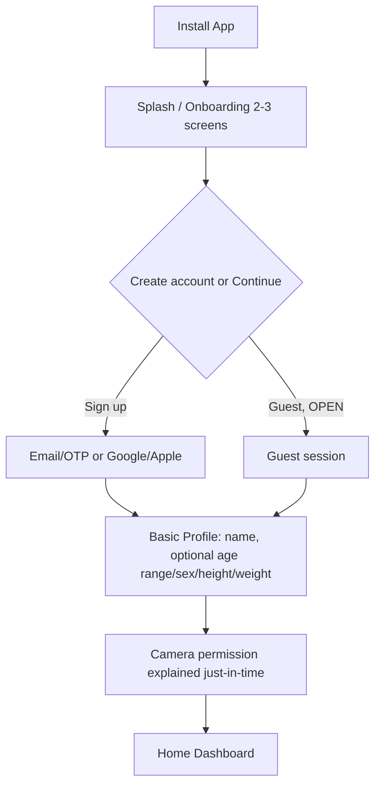

**[CONFIRMED]** Profile is minimal. No goal-setting or recommendation screens in V1. Optional fields are used only for display (and later personalization).

## 8.2 Food scanning workflow

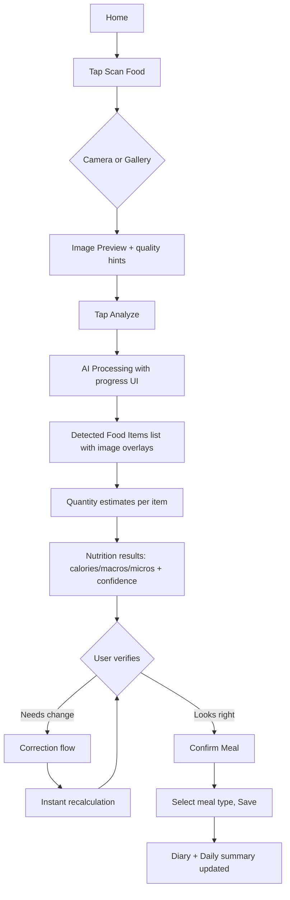

## 8.3 Correction workflow (detailed)

The result screen shows one **card per detected item**. Each card has: thumbnail crop, food name, Top-3 chips (when confidence is low), quantity with unit, calories, confidence badge, and actions.

| User action | UI | System behavior |
|---|---|---|
| **Change detected food** | Tap name, pick from Top-3 chips or search | Replace canonical food ID; keep quantity (grams) unless the unit becomes invalid; recalc via Nutrition Engine (no vision call). Log `food_changed`. |
| **Change variant** | Variant chips under the food name (shown when the resolver reports variant ambiguity, e.g., "Home-style / Restaurant-style") | Rebind `variant_id` to the same canonical food; keep grams; recalc via Nutrition Engine (no vision call). Log `variant_changed`. |
| **Remove food** | Swipe or delete icon | Remove item from draft; update totals. Log `item_removed` (signal: false positive). |
| **Add missed food** | "+ Add item" then search; optional tap on image to attach a region | Add item with user-provided quantity or default serving. Log `item_added` (signal: false negative). |
| **Change quantity** | Stepper / numeric input / slider | Recalc. Log `quantity_changed` with before/after. |
| **Change serving unit** | Unit dropdown (g, roti, katori, cup, piece, tbsp...) | Convert via serving-unit table, preserving total grams; recalc. |
| **Recalculate** | Automatic on every edit | Debounced call to `POST /nutrition/calculate`, with local optimistic estimate allowed. |
| **Confirm** | "Confirm meal" button | Persist meal and correction events; mark prediction as verified. |

**Worked example**

```text
AI:    Paneer Butter Masala, 150 g   (food conf 0.91, portion conf 0.55)
User:  Change food to "Paneer Tikka"
       Change quantity to 120 g
System:
  1. food_id: PANEER_BUTTER_MASALA -> PANEER_TIKKA
  2. quantity_g: 150 -> 120
  3. Nutrition Engine recalculated from DB profile (per-100 g x 1.2)
  4. Correction event stored: {original_food, corrected_food, original_qty, corrected_qty, ts, image_ref, model_versions}
  5. Item marked source = "user_corrected" (confidence displayed as "Verified by you")
```

## 8.4 Uncertain-prediction UX

| Situation | Presentation |
|---|---|
| Top-1 >= high threshold (**[TBV]**, e.g., 0.85) and margin over Top-2 is large | Show Top-1, normal style |
| Medium confidence | Show Top-1 plus 2 alternative chips: "Not sure? Pick one" |
| Low confidence (< low threshold, **[TBV]** e.g., 0.50) | Message: *"We're not fully sure about this food. Please select from these options."* plus Top-3 plus search |
| Unknown / out-of-domain | "We couldn't recognize this item. Search to add it." Logged as `unknown_food` for taxonomy gap analysis |

## 8.5 Meal diary workflow
Home dashboard shows today's totals (calories, protein, carbs, fat, selected micros), list of meals by type, and a date picker. Tap meal to see items and edit/delete.

---

# 9. System Workflow

## 9.1 End-to-end sequence

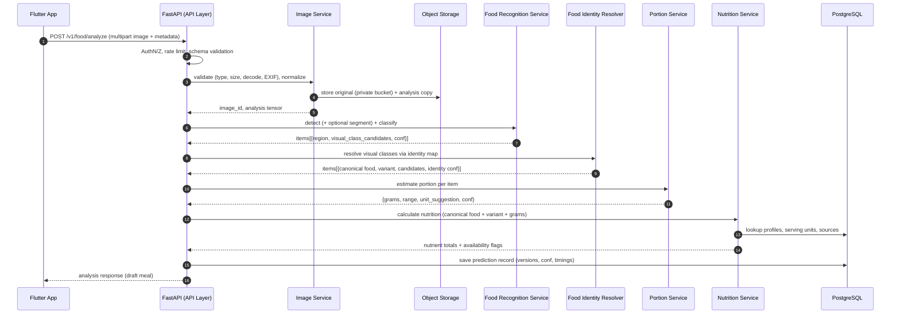

## 9.2 Step-by-step processing definition

| # | Step | Input | Processing | Output | Failure handling |
|---|---|---|---|---|---|
| 1 | Request | Image + metadata | TLS, auth, rate limit | Accepted request | 401/413/429 |
| 2 | Image validation | Raw bytes | MIME sniffing, size cap, decode check, dimension limits, strip GPS EXIF | Valid image or error | 400/415/422 with reason code |
| 3 | Preprocessing | Valid image | Orientation fix, resize (long side e.g. 1024 px, **[TBV]**), color normalization, quality scores (blur via Laplacian variance, exposure) | Normalized tensor + quality report | Quality warnings, continue |
| 4 | Detection | Normalized image | Food detector inference | Boxes + objectness/class group + conf | Empty detection -> fallback flow |
| 5 | Segmentation *(optional, experimental; skipped in the detection-only baseline)* | Image + boxes | Instance mask per box (SAM-style promptable segmenter or YOLO-seg, **[TBV]**) | Mask per item | Fallback: box-as-region |
| 6 | Classification | Region crop (box crop; masked only if segmentation is adopted) | Classifier inference, calibrated probabilities | Top-K **visual classes** + conf | Low conf -> UI alternatives |
| 6b | **Food Identity Resolution** | Visual class candidates + identity map | Map visual classes to canonical food + variant candidates; resolve aliases; flag variant ambiguity (no ML) | Canonical food, variant, candidates, identity confidence | Unmapped class -> `unknown_food` path; ambiguous -> default variant + user chips |
| 7 | Portion estimation | Region (box, or mask if available), image, canonical food, optional reference | Area/depth/learned model + density priors | grams, range, conf | Fallback: default serving and low confidence flag |
| 8 | Variant -> profile binding | Canonical food + variant + grams | Select version-pinned NutritionProfile for the variant (default variant if unresolved) | Profile reference + source | Missing profile -> partial-result flags |
| 9 | Nutrition lookup | food_id, grams | DB profile lookup, unit conversion | Nutrient set + source | Missing -> partial result flags |
| 10 | Nutrition calculation | Profile + quantity | per-100 g scaling, summation | Item and meal totals | Rounding policy defined (Section 18) |
| 11 | Confidence generation | Component confidences | Combine into food/portion/nutrition levels | Confidence object | Always produced |
| 12 | Response | All above | Serialize schema v1 | JSON | Standard error envelope |
| 13 | Render | JSON | Result UI | Editable draft meal | Offline/error states |

**[CONFIRMED]** Steps 4-7 sit behind interfaces so any model can be replaced; step 5 may be absent (detection-only baseline). Step 6b is deterministic and map-driven, so nutrition records can change without classifier retraining. Steps 8-10 never import vision code or visual class IDs. **The classifier must not directly determine the final nutrition database entry.**


---

# 10. High-Level Architecture

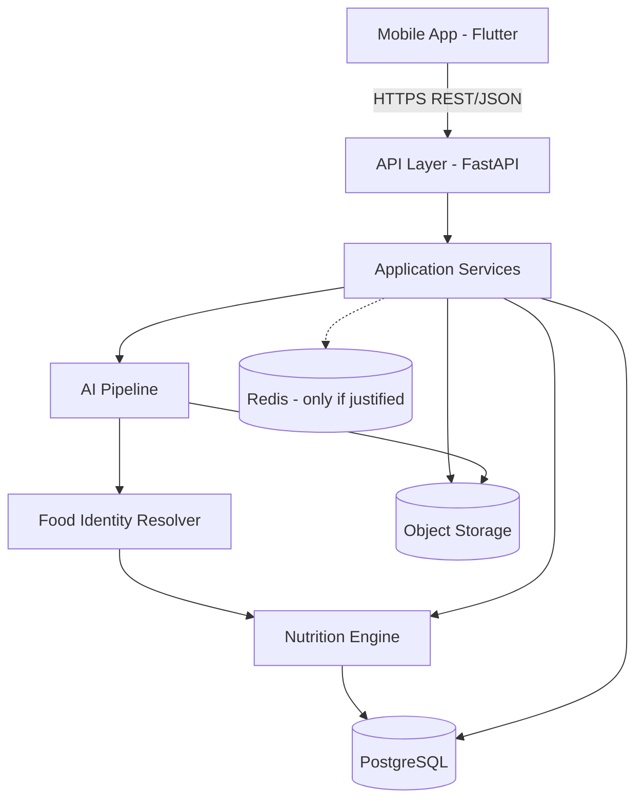

**[CONFIRMED]** Layering rule: *Mobile -> API -> Services -> (AI Pipeline -> Food Identity Resolver -> Nutrition Engine) -> Data.* The Nutrition Engine has **no dependency** on the AI pipeline or on visual class IDs. The vision models have **no dependency** on nutrition tables. The only bridge is the Food Identity Resolver, which reads the versioned identity map.

## 10.1 AI pipeline view


## 10.2 Feedback loop view

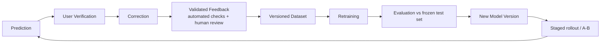

---

# 11. Detailed Architecture

## 11.1 Component view

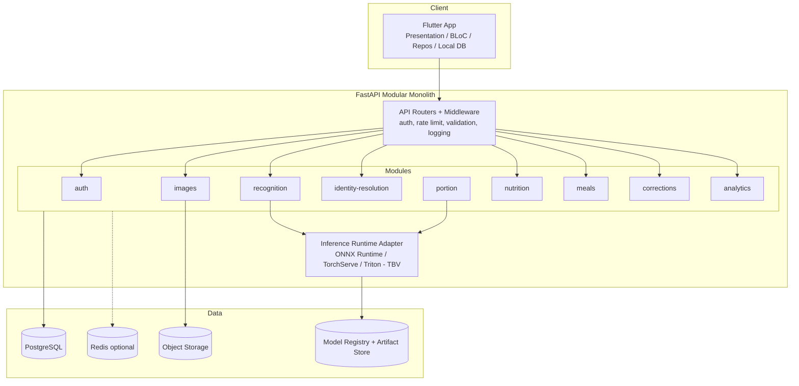

## 11.2 Module contract rules **[CONFIRMED]**
1. Each module exposes a Python interface (Protocol/ABC) plus Pydantic request/response models.
2. Modules communicate via these interfaces (in-process calls in V1). No module imports another module's database models directly.
3. Each module owns its tables (schema namespace) and migrations.
4. Cross-module data exchange uses IDs and DTOs, so later extraction into separate services is mechanical.

## 11.3 Evolution path from modular monolith to services **[PROPOSED]**

| Stage | Trigger | Action |
|---|---|---|
| V1 | Single team, low traffic | One FastAPI deployable, separate CPU API and GPU inference worker processes |
| V1.5 | Inference load/latency or GPU cost | Extract `inference-service` (recognition + portion) behind internal gRPC/HTTP, with unchanged interfaces |
| V2 | Feedback pipeline grows | Extract ML-ops/data pipeline jobs (batch workers) |
| V3 | Team scale, independent release needs | Extract `nutrition-service` (read-heavy, cacheable), others as needed |

---

# 12. Mobile Architecture

## 12.1 Technology selection (see ADR-001)
**[PROPOSED]** **Flutter + Dart**. Rationale: single codebase for Android/iOS, strong camera/image plugins, good performance, mature state-management, and a viable path to on-device inference via TFLite/Core ML platform channels or FFI in Phase 10. Native Kotlin/Swift reconsidered only if Phase 10 shows unacceptable on-device camera/ML integration cost.

## 12.2 Layered design

| Layer | Responsibility | Examples |
|---|---|---|
| Presentation | Screens, widgets, navigation, theming | `ScanScreen`, `ResultScreen`, `MealDiaryScreen` |
| Business Logic | State and use-cases | BLoC/Cubit (or Riverpod, **[TBV]** team choice), `AnalyzeFoodUseCase`, `CorrectItemUseCase` |
| Domain | Pure Dart entities and repository interfaces | `Meal`, `FoodItem`, `NutritionSummary` |
| Data | Repository implementations, DTO mapping | `MealRepositoryImpl` |
| Network | HTTP client, interceptors, retry, auth refresh | `dio`, `AuthInterceptor`, upload progress |
| Local Storage | Offline cache, drafts, queued uploads | `drift`/SQLite for meals and cache; `flutter_secure_storage` for tokens |
| Authentication | Sign-in flows, token refresh | Google/Apple/email-OTP |
| Camera Module | Capture, permission, orientation, compression | `camera`, `image_picker`, `flutter_image_compress` |
| Nutrition Module | Local recalculation for instant edits (mirrors server math via cached profiles) | `NutritionCalculator` |
| Meal Diary Module | Save/list/aggregate meals | `DiaryRepository` |

## 12.3 Folder structure

```text
mobile/
├── lib/
│   ├── main.dart
│   ├── app/                      # app shell, routing, DI, theme, env config
│   ├── core/
│   │   ├── network/              # dio client, interceptors, error mapping
│   │   ├── storage/              # secure storage, local DB (drift)
│   │   ├── errors/               # failures, exceptions
│   │   ├── utils/                # unit conversion helpers, formatters
│   │   └── widgets/              # shared UI components
│   ├── features/
│   │   ├── auth/                 {data, domain, presentation}
│   │   ├── profile/              {data, domain, presentation}
│   │   ├── scan/                 # camera, preview, analyze flow
│   │   ├── result/               # detected items, confidence UI
│   │   ├── correction/           # edit/add/remove, search
│   │   ├── nutrition/            # calculator, nutrient models
│   │   ├── diary/                # meals, daily summary, history
│   │   └── settings/             # privacy, deletion, about
│   └── l10n/
├── test/                         # unit + widget tests
├── integration_test/             # e2e flows
└── pubspec.yaml
```

**[CONFIRMED]** Each feature follows `data / domain / presentation` so features can be built and tested independently per phase.

## 12.4 Key mobile decisions
- **Image compression before upload:** long edge about 1280 px, JPEG quality about 85, target <= 1.5 MB (**[TBV]** tradeoff vs accuracy).
- **Drafts:** an unsaved analysis result persists locally so app kill does not lose edits.
- **Offline behavior:** diary viewing offline; manual logging queued; scanning requires network in V1 (Phase 10 evaluates on-device).
- **Accessibility:** dynamic font scaling, semantics labels, 4.5:1 contrast.
- **Variant selection:** when the resolver flags variant ambiguity, the result card shows variant chips; selection triggers instant local recalculation (Section 8.3).

---

# 13. Backend Architecture

## 13.1 Selection (see ADR-002)
**[PROPOSED]** Python **FastAPI** + Pydantic v2 + SQLAlchemy 2 + Alembic. Reasons: native Python for PyTorch/ONNX/OpenCV, automatic OpenAPI schema, async I/O, type-checked contracts.

## 13.2 Modular monolith **[CONFIRMED for V1]**
No microservices at first. Reasons: one small team, simpler debugging/deployment, no distributed-transaction complexity, and the hard problems are ML quality and data, not service scale. Module boundaries (11.2) preserve the extraction path.

## 13.3 Services

| Service/Module | Responsibility | Key interface | Depends on |
|---|---|---|---|
| Authentication | Sign-up/in, tokens, account deletion | `AuthService` | DB |
| Image | Validate, sanitize, store, signed URLs, retention | `ImageService.ingest()` | Object storage |
| Food Recognition | Detection, classification (segmentation only if enabled) orchestration; outputs visual classes | `RecognitionService.analyze(image)` | Inference adapter, model registry |
| Food Identity Resolution | Visual class -> canonical food + variant; alias handling; ambiguity flags (deterministic, no ML) | `IdentityResolver.resolve(pred)` | Identity map (DB), Nutrition food catalogue (read-only IDs) |
| Portion Estimation | Grams, range, confidence | `PortionService.estimate(item, image)` | Inference adapter, priors from Nutrition |
| Nutrition | Food search, normalization, unit conversion, calculation | `NutritionService.calculate(items)` | DB only |
| Meal | Draft to confirmed meals, diary, daily totals | `MealService` | Nutrition, DB |
| User Correction | Persist correction events, feedback queue | `CorrectionService` | DB, Image |
| Analytics | Product and ML metrics aggregation | `AnalyticsService` | DB |

## 13.4 Request handling model
- **Synchronous path (V1):** `POST /food/analyze` returns result in one request (target <= 4 s MVP). Simple and sufficient while latency is low.
- **Async path (optional; introduced only if the synchronous path fails defined latency/scalability requirements, Section 32.1):** if inference exceeds timeouts, return `202 + job_id`, client polls or receives push. Requires a queue (Redis + RQ/Celery/Arq). Introduced **only** if measured latency demands it.

## 13.5 Inference topology
- API process (CPU) calls an **inference runtime adapter**. In V1, adapter loads ONNX models in a GPU worker process (or same host on small GPU/CPU for early phases).
- Adapter abstraction allows swapping ONNX Runtime, TorchServe, or Triton (**[TBV]** in Phase 10/11).

---

# 14. AI/ML Architecture

## 14.1 Design stance
A **cascade of specialized models** with stable interfaces, each evaluated separately.

```text
[Detector] -> boxes
[Segmenter] -> masks (per box)   -- OPTIONAL / experimental (TBV, ADR-010)
[Classifier] -> visual class + calibrated probabilities (per region)
[Identity Resolver] -> canonical food + variant (deterministic, map-driven; no ML)
[Portion Estimator] -> grams (per item), optionally using [Depth model]
```

## 14.2 Technology evaluation matrix

| Technology | Verdict | Role | Train/Infer | Where inference runs | Alternatives considered |
|---|---|---|---|---|---|
| **PyTorch** | **Selected** | Training framework for all models | Training (and export) | n/a | TensorFlow/Keras (strong TFLite path, but PyTorch has better research/model availability, **TBV** not needed) |
| **OpenCV** | **Selected** | Decode/resize/blur/exposure checks, geometry (reference object/plate ellipse fitting), mask post-processing | Both | Server (later on-device via native bindings if needed) | Pillow (lighter, less geometry tooling) |
| **YOLO-family detector** (e.g., YOLOv8/YOLO11 or RT-DETR) | **Selected for detection (class-agnostic "food item" or coarse groups)** | Multi-food detection, fast | Train + Infer | Server (V1) | Faster R-CNN (slower), DETR variants (heavier, TBV RT-DETR). **License check required** (e.g., Ultralytics AGPL) **[OPEN]**; alternatives: YOLOX, RT-DETR (Apache) |
| **Segmentation model** | **Experimental / optional (adopted only if the Phase 4 ablation shows measurable benefit); TBV between** (a) YOLO-seg instance head, (b) SAM/SAM2/MobileSAM promptable by detector boxes, (c) Mask2Former | Per-item mask for portion and cleaner classification crop | Train (fine-tune) + Infer | Server | U-Net (semantic only; poor for instances) |
| **CNN classifier** (EfficientNetV2 / ConvNeXt / ResNet50) | **Candidate** | Baseline classifier; strong accuracy-per-compute, easy to export | Train + Infer | Server first; mobile later | MobileNetV3 (distilled student for on-device) |
| **Vision Transformer** (ViT / Swin / DINOv2-backbone) | **Candidate, TBV** | Higher fine-grained accuracy with pretraining; better few-shot | Train + Infer | Server | CNN only (ADR-004) |
| **CLIP-like (e.g., OpenCLIP/SigLIP)** | **Selected for supporting roles, not as primary classifier** | (1) Backbone/embedding for classifier fine-tuning, (2) open-set "unknown food" detection via embedding distance, (3) zero-shot label bootstrapping for annotation pre-labeling | Both | Server | Pure supervised only |
| **Monocular depth** (Depth Anything V2 / MiDaS / ZoeDepth) | **TBV for Phase 5 experiment** | Relative depth cues for volume; metric depth unreliable without reference | Infer (fine-tuning optional) | Server | Phone LiDAR/ARCore depth (**[FUTURE]**, device-dependent) |
| **ONNX / ONNX Runtime** | **Selected** | Portable export format, server inference, bridge to mobile | Export + Infer | Server (V1) | TorchScript, TensorRT (optimization stage) |
| **TensorFlow Lite** | **Evaluated in Phase 10** | Android on-device inference | Infer | On-device | ONNX Runtime Mobile, ExecuTorch |
| **Core ML** | **Evaluated in Phase 10** | iOS on-device inference | Infer | On-device | ONNX Runtime Mobile |
| **TensorRT** | **Optional; only if Phase 10 benchmarks show the selected runtime cannot meet latency targets** | GPU latency optimization | Infer | Server GPU | Plain ONNX Runtime CUDA |

## 14.3 Selected V1 baseline **[PROPOSED]**

| Stage | Baseline model | Reason |
|---|---|---|
| Detection | YOLO-family (license-cleared) detector, fine-tuned, **class set = coarse food groups + generic "food item"** | Fast multi-object; avoids needing hundreds of detector classes |
| Segmentation | **Experimental / optional:** box-prompted segmenter (MobileSAM/SAM2 or YOLO-seg), evaluated in the Phase 4 ablation | Adopted only if it measurably improves item separation or portion error; baseline is detection-only |
| Classification | EfficientNetV2-S or ConvNeXt-Tiny fine-tuned; ViT/DINOv2 challenger | Compare under same data in Phase 3 |
| Portion | Hybrid: region area (mask if available, else box + geometry priors) + reference scale + learned regressor + food-density priors | See Section 17 |
| Identity resolution | Versioned identity map (visual class -> canonical food/variant), deterministic resolver | Decouples visual recognition from nutrition identity; nutrition records change without retraining |
| Unknown detection | Max-softmax + temperature scaling + embedding-distance OOD check | Avoid confident wrong answers |

## 14.4 Why not one end-to-end model? (ADR-005)
- Calorie from pixels hides errors: cannot tell if identity or portion failed.
- Nutrition DB updates (e.g., corrected values) would require retraining.
- User correction maps naturally to modular outputs.
- Datasets for end-to-end calorie labels do not exist at needed scale for Indian food.

## 14.5 Model interface contract **[CONFIRMED]**

```python
class Detector(Protocol):
    version: str
    def detect(self, image: ImageTensor) -> list[Detection]: ...

# OPTIONAL: may be absent (detection-only baseline)
class Segmenter(Protocol):
    version: str
    def segment(self, image: ImageTensor, boxes: list[Box]) -> list[Mask]: ...

class FoodClassifier(Protocol):
    version: str
    def classify(self, crop: ImageTensor, mask: Mask | None, top_k: int = 3) -> ClassPrediction: ...

class FoodIdentityResolver(Protocol):
    version: str
    identity_map_version: str
    def resolve(self, pred: ClassPrediction, ctx: ResolveContext) -> IdentityResolution: ...

class PortionEstimator(Protocol):
    version: str
    def estimate(self, ctx: PortionContext) -> PortionEstimate: ...
```

Every implementation reports `version`; the classifier also reports `visual_labelset_version` and `preprocess_version`; the resolver reports `identity_map_version`. Every prediction record stores all of them.

## 14.6 Confidence generation **[PROPOSED]**

| Confidence | Source | Calibration |
|---|---|---|
| **Food identity** | Classifier softmax, temperature-scaled; margin between Top-1 and Top-2; OOD score; resolver ambiguity (mapping/variant uncertainty) | Calibrate on validation set; report ECE (Expected Calibration Error) |
| **Portion** | Mask quality, reference-object presence, depth agreement, food-type variability (e.g., rice vs roti), regressor uncertainty (ensemble/quantile) | Quantile regression gives a range (e.g., P20-P80 grams) |
| **Nutrition** | Propagation: identity uncertainty x portion range x recipe variability of the food variant x data source quality | Returned as range for calories (e.g., 310-420 kcal) plus a level (High/Medium/Low) |

**[CONFIRMED]** Raw model probabilities are never shown as percentages without calibration. UI may display levels (High/Medium/Low) and a range rather than false precision.

---

# 15. Food Detection Design

## 15.1 Responsibility
Find every distinct food item/region in an image (plate, thali compartments, bowls, loose items like rotis), output regions for downstream modules.

## 15.2 I/O contract

**Input:** normalized RGB image (long side about 1024 px) + preprocess metadata.

**Output:**
```json
{
  "detector_version": "det-0.3.1",
  "items": [
    {
      "item_id": "i1",
      "bbox": {"x": 0.12, "y": 0.30, "w": 0.28, "h": 0.25},
      "coarse_class": "curry_gravy",
      "confidence": 0.96
    }
  ],
  "image_quality": {"blur": 0.12, "exposure": "ok"}
}
```
(Coordinates normalized 0-1.)

## 15.3 Model choice
**[PROPOSED]** YOLO-family or RT-DETR, trained on **coarse food groups** (e.g., `rice`, `bread`, `dal_soup`, `gravy_curry`, `dry_sabzi`, `snack_fried`, `sweet`, `beverage`, `other_food`) rather than every dish. Fine identity is the classifier's job. Rationale: detectors get brittle with 300+ visually similar classes, annotation is cheaper, and new dishes need no detector retraining. **[TBV]** coarse-class vs single "food" class.

## 15.4 Training data and annotation
| Item | Requirement |
|---|---|
| Images | Multi-food Indian meals: thalis, plates, bowls, tiffins, restaurant and home, varied angles/lighting |
| Labels | Bounding boxes + coarse class; instance masks for a subset (feeds segmentation) |
| Annotation tools | CVAT or Label Studio; pre-labeling with the current model then human correction |
| Guidelines | Written annotation guide: one box per distinct dish; thali compartment = separate item; roti stack = one item with count attribute; partially occluded >30% marked `occluded` |
| QA | Double annotation on 10%, inter-annotator IoU >= 0.8 target; disagreements adjudicated |
| Size (**[ASSUMPTION]**) | Start 3-5k annotated multi-food images for MVP; grow through Phase 9 |

## 15.5 Metrics
mAP@0.5, mAP@0.5:0.95, per-class precision/recall, **item-level recall for "major items"** (items > X% of plate area), false positives per image, and crowded-scene breakdown (thali vs single plate).

## 15.6 Inference requirements
Latency <= 150 ms on server GPU (MVP target), <= 40 ms (Prod). NMS tuned for touching items; confidence threshold tuned for recall (prefer over-detect then let user remove).

## 15.7 Failure handling
| Failure | Behavior |
|---|---|
| Zero detections | Fallback: treat whole image as one region -> classifier; show "We couldn't find separate items" with manual add |
| Merged items (one box over two dishes) | Segmentation + classifier confidence low -> prompt user to split/add (**[TBV]** auto split by color clustering) |
| Duplicate boxes | NMS + containment rule |
| Non-food objects detected | Classifier "not food" class + OOD filter |

## 15.8 Testing & integration
Golden image set with expected box counts; regression test on every new detector version; output feeds Classification (via optional Segmentation, if adopted) as per Section 9.

---

# 16. Food Classification Design

## 16.1 Responsibility
Map a detected region to a **visual food class** (what the model sees) with calibrated confidence and alternatives. The classifier never selects a nutrition record; canonical identity is produced by Food Identity Resolution (Section 16A).

## 16.2 I/O
**Input:** region crop (box crop; masked crop only if segmentation is adopted, ADR-010) + coarse class hint from detector.

**Output:**
```json
{
  "classifier_version": "cls-0.5.0",
  "visual_labelset_version": "vis-2026.01",
  "top_k": [
    {"visual_class_id": "paneer_butter_masala", "p": 0.91},
    {"visual_class_id": "paneer_lababdar", "p": 0.06},
    {"visual_class_id": "shahi_paneer", "p": 0.03}
  ],
  "ood_score": 0.07
}
```

## 16.3 Classifier design **[PROPOSED]**
- **Label set = visual classes**, not nutrition records or recipe variants. Visual class IDs are a separate, versioned namespace (`visual_labelset_version`). Where two dishes are visually indistinguishable (e.g., some dal tadka vs dal fry), they may be **merged into one visual class**; the Food Identity Resolver (Section 16A) then returns multiple canonical-food/variant candidates and the user can pick. The initial label set is **small, high-quality and data-driven (size TBV)**: high-quality labels + reliable nutrition mapping + representative coverage take priority over the number of classes (Sections 19.5, 24.7).
- **Backbone candidates (TBV in Phase 3):** EfficientNetV2-S, ConvNeXt-T, ViT-B/16 or DINOv2-S fine-tune. Select by accuracy at fixed latency, calibration quality (ECE), and robustness on hard test slices.
- **Training techniques:** transfer learning from ImageNet/large pretraining, strong augmentation (Section 24), label smoothing, class-balanced sampling or focal loss, MixUp/CutMix (careful for similar classes), hierarchical loss (coarse group + fine class) **[TBV]**, temperature scaling after training.
- **Hierarchical taxonomy use:** if fine-class confidence is low but group confidence is high, UI can show "Some kind of paneer curry" with options (graceful degradation).

## 16.4 Presenting uncertainty
| Condition | UI |
|---|---|
| Top-1 confident | Name displayed; small "tap to change" |
| Medium | Top-3 chips with calibrated labels |
| Low | Warning message plus Top-3 plus search; item flagged "needs verification" |
| OOD | "Unknown food" prompt; search/add |

## 16.5 Metrics
Top-1, Top-3, precision, recall, F1 (macro and per-class), confusion matrix with **top confusion pairs report**, ECE, selective accuracy (accuracy at X% coverage), and OOD AUROC. **All are reported per slice (Section 26.6); an aggregate score is never reported alone.**

## 16.6 Failure handling & testing
Failure: wrong confident prediction -> mitigated by calibration, margin rule, user correction capture. Tests: frozen test set with per-slice reporting (home vs restaurant, lighting, regional), regression gate that blocks deployment if any key slice drops more than a set tolerance (**[TBV]**).

---

# 16A. Food Identity Resolution Design

**Status:** [CONFIRMED] module and responsibilities; [PROPOSED] mapping schema and scoring; [TBV] class granularity and default-variant policy.

## 16A.1 Why this module exists
The classifier answers *"what does this look like?"*. The nutrition system needs *"which canonical food and preparation variant should be used for nutrient lookup?"*. These are different questions:

- Several visually different-looking labels may be nutritionally one food (naming variants, regional names).
- One visual class may correspond to several nutrition variants (home-style vs restaurant-style gravy).
- Nutrition records, aliases and taxonomy evolve continuously; classifier retraining must not be required each time.

**[CONFIRMED]** The classifier MUST NOT directly determine the final nutrition database entry. All lookups go visual class -> Food Identity Resolver -> canonical food + variant -> nutrition profile.

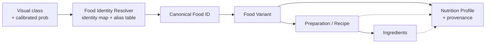

## 16A.2 Responsibilities
1. Convert visual classifier output into a canonical food identity used by the nutrition system.
2. Map visual classes to canonical Food IDs (many-to-one, one-to-many, one-to-one).
3. Resolve food aliases and naming differences (e.g., regional names, spelling and transliteration).
4. Handle visually similar foods the visual model cannot reliably separate by returning candidate sets instead of false certainty.
5. Resolve food variants where required (default variant plus alternatives).
6. Keep *visual recognition* and *nutrition-database identity* separate and independently versioned.
7. Let nutrition taxonomy and entries change without classifier retraining.

## 16A.3 Mapping cases (examples are illustrative; actual mappings are data-driven, TBV)

| Case | Example | Resolver behavior |
|---|---|---|
| Naming difference | "chapati" vs "roti" | Both names resolve (alias) to one canonical food `roti_plain`; visual class may be one label |
| Visually close, nutritionally different | plain rice vs jeera rice | If the classifier separates them reliably: 1:1 mapping. If not: one visual class `rice_plain_or_jeera` -> two candidates with a default and user chips |
| Dal family | different dal variants | Visual class(es) map to a candidate set of canonical dals; default by policy; Top-3 shown when uncertain |
| Food vs preparation | paneer curry vs paneer butter masala | Visual class `paneer_red_gravy` may map to several canonical curries (default + alternatives); a coarser group-level fallback exists |
| Regional naming | different regional names for the same vegetable | Alias table -> single canonical food; search and correction accept all aliases |
| Preparation variant | paneer (raw / grilled / curry / butter masala) | Distinct canonical foods or variants, each with its own profile; never assumed equal |
| Unmapped | New visual class without map entry | Rejected at release gate; at runtime -> `unknown_food` path |

## 16A.4 Input / output contract

**Input:** `ClassPrediction` (visual Top-K with calibrated probabilities, OOD score, coarse class), optional `ResolveContext` (meal-type hint; user-history re-ranking is [FUTURE]), active `identity_map_version`.

**Output:**
```json
{
  "resolver_version": "idr-0.1.0",
  "identity_map_version": "idmap-2026.01",
  "item_id": "i1",
  "candidates": [
    {"food_id": "paneer_butter_masala", "variant_id": "paneer_butter_masala:default", "p": 0.62,
     "basis": ["visual:paneer_red_gravy", "map_weight:0.7"]},
    {"food_id": "shahi_paneer", "variant_id": "shahi_paneer:default", "p": 0.21, "basis": ["visual:paneer_red_gravy"]}
  ],
  "selected": {"food_id": "paneer_butter_masala", "variant_id": "paneer_butter_masala:default"},
  "identity_confidence": {"level": "medium", "score": 0.62},
  "ambiguity": "food|variant|none",
  "needs_user_choice": true
}
```

**Scoring [PROPOSED, TBV]:** `P(food, variant) = sum over visual classes v of P(v) * M(food, variant | v)`, where `M` is a curated map weight (normalized per visual class), later informed by reviewed correction statistics. Variant default and weights are decided by nutritionist + data, recorded in the map, and versioned.

## 16A.5 Data and versioning
Three independently versioned artifacts (**[CONFIRMED]**):

| Artifact | Changes when | Requires classifier retraining? |
|---|---|---|
| `visual_labelset_version` | A visual class is added/merged/split | Yes (head or full fine-tune) |
| `identity_map_version` | Mapping weights, aliases, variant defaults, canonical renames change | **No** |
| `nutrition_db_version` | Nutrient values, units, recipes, sources change | **No** |

Every analysis stores all three. Deprecated foods use `merged_into` so old meals stay resolvable.

## 16A.6 Release rules for the identity map
- Every active visual class maps to >= 1 active canonical food/variant that has a complete energy+macro nutrition profile.
- Map weights per visual class sum to 1 (validated in CI).
- Golden mapping tests (reviewed by a nutritionist) must pass; changes go through review like code.
- Adding a visual class requires its map entry and nutrition coverage **before** release.

## 16A.7 Failure handling
| Failure | Behavior |
|---|---|
| Visual class has no map entry | Treat as `unknown_food`; user searches/adds; log gap |
| Mapped food lacks nutrition profile | Partial result with flags; blocked at release gate for shipped classes |
| High ambiguity | Show candidates/variant chips; low identity confidence |
| Resolver exception | Deterministic fallback: top visual class's default mapping; log error |

## 16A.8 Metrics and tests
Identity top-1/top-3 accuracy (resolved canonical food vs ground-truth canonical food), variant accuracy where variant ground truth exists, map coverage (100% for shipped classes), ambiguity rate, user variant-change rate, and **identity-attributable calorie error** (Section 26.8). Tests: unit tests on alias/map resolution, property tests (weights normalized, no orphan classes), golden mapping tests, map-change regression test (old versions still resolve).

## 16A.9 Technology and phase
Pure Python module (no ML) with tables in PostgreSQL, cached in memory; built and tested in **Phase 2** without AI, wired to the classifier in Phase 3 (dev) and into the full pipeline in Phase 6.

---

# 17. Portion Estimation Design

## 17.1 Honest statement of limits **[CONFIRMED]**
Grams cannot be exactly derived from a single RGB image. Missing: depth/volume, container depth (a katori can be shallow or deep), food density, packing, and hidden layers. The system therefore outputs a **range with confidence** and **requests user correction cheaply**. Portion benchmarking is independent of classification benchmarking.

## 17.2 Approaches evaluated

| Approach | How | Strengths | Weaknesses | Verdict |
|---|---|---|---|---|
| Segmentation area | Pixel area of mask (or box area as baseline), converted to cm² using a scale | Cheap, interpretable | Needs scale; ignores height; mask needs segmentation (optional, TBV) | Optional component; box-based baseline is compared in the Phase 4/5 ablations |
| Reference object | Known-size object (coin, card, standard plate/katori, thumb/hand) | Gives metric scale | Users won't always include; adds friction | Optional, opportunistic |
| Plate/bowl dimension | Detect plate ellipse; assume standard diameter (e.g., 22-27 cm, **[TBV]**) | No user effort | Plate size varies | **Primary scale prior** |
| Known food dimensions | Roti diameter (about 15-20 cm), idli/samosa/laddu counts x unit weight | Highly accurate for countable items | Only discrete items | **Use for countables** |
| Monocular depth | Relative depth -> volume proxy | Adds height cue | Relative scale; fails on reflective gravies | **TBV experiment** |
| Computer-vision geometry | Camera pose/perspective correction using plate ellipse | Corrects tilt | Complexity | Include basic homography |
| Learned portion estimator | CNN/ViT regression head on (crop, mask, geometry features) predicting grams or serving-ratio, trained on weighed-meal data | Learns food-specific density/shape | Needs weighed dataset | **Core of Phase 5** |
| User-assisted correction | Slider/stepper, katori icons, "compare to standard serving" | Most reliable | Needs interaction | **Always available** |
| Phone depth sensors (LiDAR/ARCore) | Metric depth | Better accuracy | Device-limited | **[FUTURE]** |

## 17.3 Proposed hybrid design **[PROPOSED, TBV]**

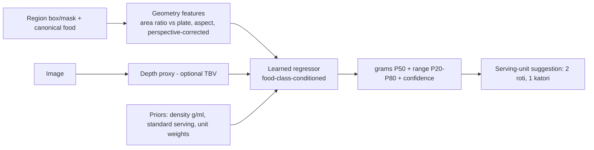

Strategy by food type:
| Food type | Primary strategy |
|---|---|
| Countable (roti, idli, samosa, dosa, puri) | Count instances x calibrated unit weight (+ size class small/medium/large) |
| Bowl foods (dal, sabzi, curd, kheer) | Bowl detection + fill-level + assumed katori volume x density; user selects katori size (small/medium/large) |
| Plated heaps (rice, biryani, pulao) | Mask area vs plate + learned height factor; uncertainty high |
| Liquids (lassi, chai) | Glass/cup size classes x fill level |

## 17.4 I/O
**Input:** `PortionContext {image, region (bbox; mask if available), canonical_food_id, variant_id?, plate_geometry?, depth_map?, reference?}`.
**Output:**
```json
{
  "portion_estimator_version": "por-0.2.0",
  "grams": 180,
  "range_g": [140, 230],
  "suggested_unit": {"unit": "katori", "qty": 1.0},
  "confidence": 0.55,
  "method": "mask_area_plate_prior+regressor"
}
```

## 17.5 Data needed
Weighed-meal dataset: photographs with **ground-truth gram weights** per item (kitchen scale), multiple plate/bowl types, multiple angles (**[ASSUMPTION]** 2-5k weighed items for MVP-quality regressor). Collection protocol defined in Phase 5.

## 17.6 Metrics
MAE (g), RMSE (g), MAPE (%), **median absolute percentage error** (robust), % within ±20% / ±30%, bias (systematic over/under), reported per food type. Benchmarked **independently of classification** by feeding ground-truth class.

## 17.7 Failure handling
Cannot segment / no scale -> default serving size from DB with confidence "Low" and banner "Please check the quantity". Portion unreasonable (e.g., 1.2 kg roti) -> clamp to plausible range per food and flag.

---

# 18. Nutrition Engine

## 18.1 Separation **[CONFIRMED]**
The Nutrition Engine is a **pure, deterministic library + API**. It has no computer-vision dependency, is fully unit-testable, and is usable by manual logging, correction recalculation, and AI results identically.

## 18.2 Input / output

**Input:**
```json
{"items":[{"food_id":"roti_plain","variant":"home","quantity":2,"unit":"roti"},
          {"food_id":"dal_tadka","variant":"default","quantity":1,"unit":"katori"}]}
```
**Output (per item and total):**
```json
{
  "items":[{
    "food_id":"roti_plain","grams":80,
    "nutrients":{"energy_kcal":{"value":238,"availability":"available","source_id":"IFCT2017"},
                 "protein_g":{...},"carbs_g":{...},"fat_g":{...},
                 "fiber_g":{...},"sugar_g":{...},"sodium_mg":{...},
                 "calcium_mg":{...},"iron_mg":{...},"potassium_mg":{...},
                 "vitamin_a_ug":{...},"vitamin_c_mg":{...},"vitamin_b12_ug":{...},"folate_ug":{...}},
    "range_kcal":[210,270]
  }],
  "totals":{...},
  "warnings":["vitamin_b12 unavailable for dal_tadka"]
}
```

## 18.3 Calculation algorithm
1. Resolve `food_id` + `variant` -> `NutritionProfile` (per 100 g basis, version-pinned).
2. Convert `(quantity, unit)` -> grams via `ServingUnit.grams` (food-specific first, generic fallback, e.g., 1 roti = 40 g **[TBV by dataset]**).
3. `nutrient_value = per_100g * grams / 100`.
4. Sum across items; each nutrient keeps **availability** (`available | estimated | missing`). A total includes only available/estimated values and carries a "partial" flag if any item is missing it.
5. Round for display only: calories to nearest 5 kcal, macros to 0.1 g, micros 2-3 significant figures. Internal precision retained.
6. Compute range using variant variability (stored `kcal_min/kcal_max` or coefficient of variation) and portion range.

## 18.4 Micronutrient reliability **[CONFIRMED]**
Not every food has reliable values for every micronutrient (lab data exist for raw ingredients; cooked mixed dishes are often computed from recipes or missing). Rules:
- Missing is **never shown as 0**; shown as "-" with tooltip "Data not available".
- Each value carries `source_id` and `method` (`analytical`, `recipe_calculated`, `imputed`).
- Daily totals of micros display "based on available data" and show coverage percent.

## 18.5 Unit conversion
Conversion table hierarchy: **food-specific unit** (1 roti plain = 40 g; 1 katori dal = about 150 g) -> **category default** (bowl of gravy) -> **generic** (g, ml with density, cup/tbsp/tsp). Handles volume->mass via density. All conversions stored with source and "confidence".

## 18.6 Failure handling & testing
Unknown food -> `404 FOOD_NOT_FOUND` with suggestions. Unit not defined -> `422 UNIT_NOT_SUPPORTED` plus allowed units. Tests: property-based tests (linearity, additivity, non-negativity), golden calculations verified by a nutrition professional, unit-conversion round-trip tests.

## 18.7 Boundary with Food Identity Resolution **[CONFIRMED]**
The Nutrition Engine accepts only canonical `food_id` (+ optional `variant_id`), never visual class IDs. It does **not** assume that a visual class uniquely determines calories, macros or micros: when the variant is unresolved, the engine uses the food's default variant, returns a **range** that reflects variant variability (`kcal_min/kcal_max` across variants or within the default), and marks `variant_source = default|resolver|user`. A user variant change triggers an immediate recalculation. Provenance is preserved per nutrient, and unavailable values are never represented as zero.

---

# 19. Nutrition Database

## 19.1 Entities (summary; full DDL in Section 22)

| Entity | Purpose |
|---|---|
| Food | Canonical food (`food_id`, display name, category, visual class mapping) |
| FoodVariant | Preparation/context variant (home, restaurant, low-oil...) with its own profile (**[PROPOSED]**) |
| FoodAlias | Alternate names/languages mapped to canonical food |
| FoodCategory | Hierarchical taxonomy |
| ServingUnit | Units and grams conversion, per-food or generic |
| NutritionProfile | Nutrient values per 100 g for a food/variant, versioned |
| Recipe | Recipe composition for dish-level calculation |
| Ingredient | Raw ingredient with its own profile |
| RecipeIngredient | Join with grams and cooking-loss factors |
| NutritionSource | Data source registry (provenance) |
| VisualClass | A class of the classifier's versioned visual labelset (not a nutrition record) |
| LabelsetVersion / IdentityMapVersion | Versioning of visual classes and of the visual-class -> food/variant map |
| VisualClassMapping | Weighted mapping: visual class -> canonical food + variant (the Food Identity Resolution map) |

**Identity-to-nutrition chain:** `Visual class -> Canonical Food -> Food Variant -> Preparation/Recipe -> Ingredients -> Nutrition Profile`. Profiles attach to variants (or are computed from recipe + ingredients with retention factors). The same visually recognized food can have different nutrient values depending on preparation.

## 19.2 Normalization example
```text
"Paneer Butter Masala"
"Paneer Butter Masala Curry"      -> food_id = paneer_butter_masala
"Butter Paneer"
"Paneer Makhani"  (decision: alias or separate? OPEN - culinary experts)
```
Normalization pipeline: lowercase, strip punctuation and stop-words ("curry", "masala" handled carefully), transliteration (Hindi/Hinglish), alias table lookup, fuzzy match (trigram/pg_trgm), then human-curated mapping for ambiguous cases. Classifier outputs are **never** looked up as `food_id` directly: visual classes map to canonical foods/variants only through the versioned identity map (Section 16A).

## 19.3 Data source strategy (see ADR-007) **[PROPOSED]**
| Priority | Source | Use | Note |
|---|---|---|---|
| 1 | **IFCT 2017** (Indian Food Composition Tables, NIN) | Primary for Indian raw foods/ingredients and some preparations | Verify license/terms of use **[OPEN]** |
| 2 | **USDA FoodData Central** | Fallback for generic foods, micros | Public domain |
| 3 | Recipe-computed profiles (ingredient-based, with cooking yield/retention factors) | Mixed dishes without lab values | Recipes curated by a nutritionist; method = `recipe_calculated` |
| 4 | Manufacturer/restaurant data | Packaged/branded **[FUTURE]** | |
| 5 | Nutritionist-reviewed estimates | Gaps | Marked `estimated` |

Rules: every profile row stores `source_id`, `source_reference`, `method`, `version`, `reviewed_by`, `reviewed_at`. Conflicts between sources resolved by priority + review, never silently averaged. Licensing checked **before** ingestion.

## 19.4 Cooking-method and recipe variability
Same dish, different recipes (e.g., oil/ghee varies widely). Design: store a **default profile** plus optional **variants** (`home_light`, `restaurant_rich`), each with kcal range. V1 shows default and a range; variant selection UI is a **Post-MVP** nicety unless data shows large error.

## 19.4A Preparation variants and uncertainty **[CONFIRMED]**
Example: *Paneer* may be raw paneer, grilled paneer, paneer curry or paneer butter masala, each with different calories, fat and micronutrients. When preparation cannot be reliably inferred from the image, the system (1) presents the most appropriate candidate, (2) exposes the uncertainty (variant chips, calorie range), (3) allows user correction/variant selection, and (4) recalculates immediately. Nutrition provenance remains traceable per value, and unavailable micronutrients are never shown as zero. Hidden-ingredient inference beyond what the image supports is [FUTURE] (Section 37).

## 19.5 Food taxonomy **[PROPOSED]**

```text
Indian Food
├── Rice & Grain Dishes
│   ├── Plain rice (steamed, jeera)
│   ├── Pulao / Biryani
│   ├── Khichdi
│   └── Poha / Upma / Daliya
├── Dal & Legumes
│   ├── Dal tadka / fry / makhani
│   ├── Sambar / Rasam
│   ├── Rajma / Chole / Lobia
│   └── Kadhi
├── Roti / Bread
│   ├── Roti / Chapati / Phulka
│   ├── Paratha (plain, stuffed)
│   ├── Naan / Kulcha
│   ├── Puri / Bhatura
│   └── Dosa / Uttapam / Idli / Vada (South Indian tiffin)
├── Sabzi (Vegetable dishes)
│   ├── Dry (aloo gobi, bhindi)
│   └── Gravy (baingan bharta, mix veg)
├── Paneer Dishes
├── Curries (Non-paneer: egg, chicken, mutton, fish)
├── Snacks (samosa, pakora, kachori, chaat, dhokla)
├── Sweets (gulab jamun, jalebi, rasgulla, halwa, ladoo)
├── Beverages (chai, lassi, buttermilk, sugarcane, nimbu pani)
├── Accompaniments (curd/raita, salad, pickle, papad, chutney)
└── Mixed Meals (thali, tiffin, combo - handled as MULTI-ITEM, not one class)
```

**Justification:** Mirrors how Indian meals are composed (grain + dal + sabzi + bread + accompaniments), aligns with detector coarse groups, supports hierarchical classification, and keeps "thali" as a composition of items rather than a class (a thali class would destroy portion/nutrition accuracy). The initial taxonomy and visual label set are **small, high-quality and representative; the number of classes is TBV and data-driven**, not a requirement. Selection prioritizes frequently consumed foods, foods with reliable nutrition data, representative regional coverage and visual distinguishability, and expands iteratively (Section 24.7). Priority is *high-quality labels + reliable nutrition mapping + representative coverage* over *maximum number of classes*.


---

# 20. Data Architecture

| Store | Technology | Content | Notes |
|---|---|---|---|
| Relational DB | PostgreSQL 16 | Users, meals, foods, nutrition, predictions, corrections, audit | System of record. `pg_trgm` for fuzzy food search. |
| Object storage | S3-compatible (AWS S3 / GCS / MinIO) | Original images, analysis copies, thumbnails, training-set snapshots, model artifacts | Private buckets, SSE encryption, signed URLs |
| Cache (optional) | Redis | Rate-limit counters, food-search cache, job queue if async | **Justified only when** needed (rate limiting at scale or async queue). Not in Phase 1. |
| Model registry *(optional, phase-dependent; Section 32.1)* | MLflow (registry + tracking) | Model versions, metrics, lineage, stage (staging/prod) | |
| Dataset versioning *(optional, introduced when needed; Section 32.1)* | DVC (backed by object storage) | Dataset snapshots, annotation versions | Git holds pointers |
| Analytics | Postgres tables first; warehouse (BigQuery/ClickHouse) **[FUTURE]** | Product and ML metrics | |

## 20.1 Image storage design
- **Where:** object storage, key pattern `images/{user_hash}/{yyyy}/{mm}/{image_id}.jpg`. DB holds metadata only (`image_id`, `sha256`, `size`, `dimensions`, `storage_key`, `retention_class`, `consent_flags`).
- **Upload:** server-validated multipart (V1) or presigned URL (V1.5 to reduce API load).
- **Variants:** original (sanitized, EXIF/GPS stripped), analysis copy, thumbnail.
- **Compression:** client-side before upload; server stores sanitized JPEG/WebP.
- **Retention classes:** `transient` (analysis only, auto-delete in 30 days unless meal confirmed - **[TBV]** exact), `meal_linked` (kept while meal exists), `training_consented` (only with explicit opt-in, de-identified path). Details in Section 28.
- **Deletion:** user deletion cascades to DB rows and objects; lifecycle rules purge expired objects; deletion audit logged.

## 20.2 Data classification
| Class | Examples | Handling |
|---|---|---|
| Personal | Email, name, body metrics | Encrypted at rest, minimal access |
| Sensitive-ish | Meal history (health inference) | Treated as sensitive; no third-party sharing |
| Operational | Logs, metrics | Pseudonymized user IDs |
| ML training | Consented images + validated labels | Separate bucket, access-controlled |

---

# 21. API Design

## 21.1 Conventions **[CONFIRMED]**
- Base: `https://api.<domain>/v1`, JSON, UTF-8, ISO-8601 UTC timestamps.
- Auth: `Authorization: Bearer <JWT access token>`; refresh tokens rotated.
- IDs: UUIDv7 strings. Pagination: cursor-based (`limit`, `cursor`).
- Idempotency: `Idempotency-Key` header on mutating POSTs (analyze, meal).
- Error envelope:
```json
{"error":{"code":"IMAGE_TOO_LARGE","message":"Image exceeds 8 MB","details":{"max_bytes":8388608},"request_id":"req_01H..."}}
```
- Versioning: URL major version; additive changes only within a version; response includes `schema_version`.

## 21.2 Endpoint catalogue

| Method | Endpoint | Purpose | Auth | Phase |
|---|---|---|---|---|
| POST | `/auth/register`, `/auth/login`, `/auth/refresh`, `/auth/logout` | Account/session | Public / refresh | 1 |
| GET/PATCH | `/users/me` | Profile | Yes | 1 |
| DELETE | `/users/me` | Account + data deletion | Yes | 11 |
| GET | `/food/search?q=` | Food search with aliases | Yes | 2 |
| GET | `/food/{food_id}` | Food detail, units, nutrient profile | Yes | 2 |
| GET | `/food/{food_id}/variants` | Variants, defaults and per-variant nutrient ranges | Yes | 2 |
| POST | `/food/identity/resolve` | Resolve visual class -> canonical food/variant (internal/dev) | Yes (internal) | 2 |
| POST | `/nutrition/calculate` | Calculate nutrition for items | Yes | 2 |
| POST | `/food/classify` | Single-image visual classification + resolved identity (dev/Phase 3) | Yes | 3 |
| POST | `/food/detect` | Detection (dev/Phase 4) | Yes | 4 |
| POST | `/food/analyze` | Full pipeline | Yes | 6 |
| POST | `/food/correct` | Submit correction events | Yes | 7 |
| POST | `/meals` | Save confirmed meal | Yes | 8 |
| GET | `/meals/{id}` | Meal detail | Yes | 8 |
| PATCH/DELETE | `/meals/{id}` | Edit/delete meal | Yes | 8 |
| GET | `/meals?date=&cursor=` | Meal list | Yes | 8 |
| GET | `/nutrition/daily?date=` | Daily summary | Yes | 8 |
| GET | `/health`, `/ready` | Health probes | Internal | 1 |

## 21.3 Detailed specs

### 21.3.1 POST `/auth/login`
| Aspect | Spec |
|---|---|
| Purpose | Obtain tokens |
| Auth | None |
| Request | `{"method":"email_otp","email":"a@b.com","otp":"123456"}` or `{"method":"google","id_token":"..."}` / `{"method":"apple","identity_token":"..."}` |
| Response 200 | `{"access_token":"...","refresh_token":"...","expires_in":900,"user":{"id":"..."}}` |
| Validation | Email format, OTP 6 digits, token verification with provider |
| Errors | 400 `VALIDATION_ERROR`, 401 `INVALID_CREDENTIALS`, 429 `RATE_LIMITED` |

### 21.3.2 POST `/food/analyze`  (core)
| Aspect | Spec |
|---|---|
| Purpose | Run full pipeline, return a **draft meal** (not persisted as a meal) |
| Auth | Bearer JWT |
| Request | `multipart/form-data`: `image` (JPEG/PNG/HEIC->converted client-side), `meta` JSON: `{"captured_at":"...","meal_type_hint":"lunch","client":{"platform":"android","app_version":"1.0.0"},"reference_object":null,"consent_training":false}` |
| Validation | MIME sniffing; max 8 MB; min 320 px short side; max 4096 px long side; decodable; no animated formats; EXIF stripped |
| Success | `200 OK` |
| Errors | 400 `INVALID_IMAGE`; 413 `IMAGE_TOO_LARGE`; 415 `UNSUPPORTED_MEDIA_TYPE`; 422 `LOW_QUALITY_IMAGE` (with advice); 429; 503 `MODEL_UNAVAILABLE` (retry-after); 504 `INFERENCE_TIMEOUT` |

Response example:
```json
{
  "schema_version": "1.0",
  "analysis_id": "an_01J...",
  "image_id": "img_01J...",
  "model_versions": {"detector":"det-0.3.1","segmenter":null,"classifier":"cls-0.5.0","portion":"por-0.2.0","visual_labelset":"vis-2026.01","identity_map":"idmap-2026.01","resolver":"idr-0.1.0","nutrition_db":"nut-2026.01"},
  "image_quality": {"score":0.82,"warnings":[]},
  "items": [
    {
      "item_id": "i1",
      "region": {"bbox":[0.12,0.30,0.28,0.25],"mask_rle":null},
      "food": {
        "visual":{"visual_class_id":"paneer_butter_masala","score":0.91},
        "food_id":"paneer_butter_masala","variant_id":"paneer_butter_masala:default","name":"Paneer Butter Masala",
        "identity":{"resolver":"idr-0.1.0","ambiguity":"variant","variant_alternatives":[{"variant_id":"paneer_butter_masala:home_light"},{"variant_id":"paneer_butter_masala:restaurant_rich"}]},
        "confidence":{"level":"high","score":0.91},
        "alternatives":[{"food_id":"paneer_lababdar","score":0.06},{"food_id":"shahi_paneer","score":0.03}]
      },
      "portion": {"grams":150,"range_g":[110,200],"unit":{"unit":"katori","qty":1.0},
                  "confidence":{"level":"medium","score":0.55},"method":"bowl_fill+regressor"},
      "nutrition": {
        "energy_kcal":{"value":385,"range":[290,500]},
        "protein_g":{"value":14.2},"carbs_g":{"value":12.1},"fat_g":{"value":31.0},
        "fiber_g":{"value":2.1},"sugar_g":{"value":6.0},"sodium_mg":{"value":640},
        "micros":{"calcium_mg":{"value":210},"iron_mg":{"value":1.4},"vitamin_b12_ug":{"availability":"missing"}},
        "confidence":{"level":"low","score":0.45},"sources":["IFCT2017","recipe_calc_v3"]
      },
      "flags":["needs_verification"]
    }
  ],
  "totals": {"energy_kcal":{"value":640,"range":[500,820]},"protein_g":{"value":24.1},"carbs_g":{"value":70.3},"fat_g":{"value":28.0}},
  "disclaimer": "Nutrition values are estimates."
}
```

**Notes on the example:** `visual` is what the classifier recognized; `food_id`/`variant_id`/`identity` come from the Food Identity Resolver; `segmenter` is `null` and `mask_rle` is `null` in the detection-only baseline. Clients must treat `visual_class_id` as opaque and never use it for nutrition lookups.

### 21.3.3 POST `/nutrition/calculate`
| Aspect | Spec |
|---|---|
| Purpose | Recalculate nutrition for edited items (no vision call) |
| Auth | Bearer |
| Request | `{"items":[{"food_id":"paneer_tikka","variant_id":null,"quantity":120,"unit":"g"}]}` (`variant_id` optional; default variant if omitted) |
| Validation | `food_id` exists; `unit` allowed for food; `0 < quantity <= max_per_unit` (e.g., 5000 g); max 30 items |
| Response 200 | Same `nutrition` structure as above plus `totals` |
| Errors | 404 `FOOD_NOT_FOUND`, 422 `UNIT_NOT_SUPPORTED`, 422 `QUANTITY_OUT_OF_RANGE` |

### 21.3.4 POST `/food/correct`
| Aspect | Spec |
|---|---|
| Purpose | Record user corrections relative to a specific analysis |
| Request | `{"analysis_id":"an_...","events":[{"type":"food_changed","item_id":"i1","from":{"food_id":"paneer_butter_masala"},"to":{"food_id":"paneer_tikka"}},{"type":"quantity_changed","item_id":"i1","from":{"grams":150},"to":{"grams":120}},{"type":"item_added","food_id":"roti_plain","quantity":2,"unit":"roti","region_hint":[0.5,0.5]},{"type":"item_removed","item_id":"i3"}],"client_ts":"..."}` |
| Validation | `analysis_id` belongs to user; event types enumerated (incl. `variant_changed`); referenced IDs valid |
| Response | `201 {"correction_batch_id":"cb_...","recalculated":{...}}` |
| Errors | 404 `ANALYSIS_NOT_FOUND`, 409 `ALREADY_FINALIZED`, 422 `INVALID_EVENT` |
| Notes | Idempotent by `Idempotency-Key`; stored event-sourced (Section 23) |

Additional event example: `{"type":"variant_changed","item_id":"i1","from":{"variant_id":"paneer_butter_masala:default"},"to":{"variant_id":"paneer_butter_masala:home_light"}}`.

### 21.3.5 POST `/meals`
| Aspect | Spec |
|---|---|
| Purpose | Persist the confirmed meal |
| Request | `{"analysis_id":"an_...","meal_type":"lunch","eaten_at":"...","items":[{"food_id":"...","grams":120,"unit":"g","unit_qty":120,"source":"user_corrected"}],"notes":null}` (analysis_id optional for manual meals) |
| Server behavior | **Recomputes nutrition server-side** from items (never trusts client totals); snapshots nutrient values + db version into `meal_item` for historical stability |
| Response | `201` meal object |
| Errors | 400/422 validation, 404 food, 409 duplicate by idempotency key |

### 21.3.6 GET `/meals/{id}`, GET `/meals`, GET `/nutrition/daily`, GET `/food/search`
| Endpoint | Key parameters | Response summary | Errors |
|---|---|---|---|
| `GET /meals/{id}` | path id | Meal with items, snapshot nutrition, image URL (signed, short TTL) | 404, 403 |
| `GET /meals` | `date`, `from`, `to`, `meal_type`, `limit`, `cursor` | Paged list | 400 |
| `GET /nutrition/daily` | `date` (default today), `tz` | `{"date","totals":{...},"by_meal":{...},"micro_coverage":0.72}` | 400 |
| `GET /food/search` | `q` (min 2 chars), `limit<=20`, `category?` | Ranked foods (alias + trigram + popularity) with default unit | 400 |

## 21.4 Status code summary
200 OK, 201 Created, 202 Accepted (async), 204 No Content, 400 Bad Request, 401 Unauthorized, 403 Forbidden, 404 Not Found, 409 Conflict, 413 Payload Too Large, 415 Unsupported Media, 422 Unprocessable, 429 Too Many Requests, 500 Internal, 503 Unavailable, 504 Timeout.

---

# 22. Database Schema

## 22.1 ER diagram

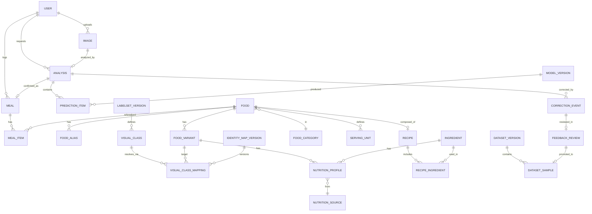

## 22.2 Core DDL (PostgreSQL, abridged but implementable) **[PROPOSED]**

```sql
-- Users
CREATE TABLE app_user (
  id UUID PRIMARY KEY, email CITEXT UNIQUE, auth_provider TEXT NOT NULL,
  display_name TEXT, age_range TEXT, sex TEXT, height_cm NUMERIC(5,1), weight_kg NUMERIC(5,1),
  timezone TEXT DEFAULT 'Asia/Kolkata', training_consent BOOLEAN NOT NULL DEFAULT FALSE,
  created_at TIMESTAMPTZ NOT NULL DEFAULT now(), deleted_at TIMESTAMPTZ
);

-- Nutrition domain
CREATE TABLE nutrition_source (
  id TEXT PRIMARY KEY,              -- 'IFCT2017','USDA_FDC','RECIPE_CALC','NUTRITIONIST'
  name TEXT, url TEXT, license TEXT, version TEXT, notes TEXT
);
CREATE TABLE food_category (
  id SERIAL PRIMARY KEY, parent_id INT REFERENCES food_category(id), slug TEXT UNIQUE, name TEXT
);
CREATE TABLE food (
  id TEXT PRIMARY KEY,              -- canonical slug e.g. 'paneer_butter_masala'
  display_name TEXT NOT NULL, category_id INT REFERENCES food_category(id),
  is_countable BOOLEAN DEFAULT FALSE, default_unit TEXT, default_grams NUMERIC(7,2),
  density_g_per_ml NUMERIC(5,3), status TEXT DEFAULT 'active',   -- active/deprecated
  merged_into TEXT REFERENCES food(id), created_at TIMESTAMPTZ DEFAULT now()
);
CREATE TABLE food_alias (
  id SERIAL PRIMARY KEY, food_id TEXT REFERENCES food(id), alias TEXT NOT NULL,
  lang TEXT DEFAULT 'en', script TEXT, UNIQUE(alias, lang)
);
CREATE INDEX food_alias_trgm ON food_alias USING gin (alias gin_trgm_ops);
CREATE TABLE food_variant (
  id TEXT PRIMARY KEY, food_id TEXT REFERENCES food(id), label TEXT,  -- 'default','home','restaurant'
  preparation TEXT,  -- 'raw','grilled','curry','butter_masala'... (optional)
  recipe_id INT NULL,  -- optional link to recipe(id); FK added by migration
  is_default BOOLEAN DEFAULT FALSE
);
CREATE TABLE serving_unit (
  id SERIAL PRIMARY KEY, food_id TEXT REFERENCES food(id) NULL,   -- NULL = generic unit
  unit TEXT NOT NULL, grams NUMERIC(8,2) NOT NULL, label TEXT,
  source_id TEXT REFERENCES nutrition_source(id), confidence TEXT,
  UNIQUE(food_id, unit)
);
CREATE TABLE nutrition_profile (
  id UUID PRIMARY KEY, food_variant_id TEXT REFERENCES food_variant(id) NULL,
  ingredient_id INT NULL, basis_g NUMERIC(6,1) NOT NULL DEFAULT 100,
  energy_kcal NUMERIC(7,2), protein_g NUMERIC(6,2), carbs_g NUMERIC(6,2), fat_g NUMERIC(6,2),
  fiber_g NUMERIC(6,2), sugar_g NUMERIC(6,2), sodium_mg NUMERIC(8,2),
  micros JSONB NOT NULL DEFAULT '{}',        -- {"calcium_mg":{"v":210,"m":"analytical"}, ...}
  kcal_min NUMERIC(7,2), kcal_max NUMERIC(7,2),
  source_id TEXT REFERENCES nutrition_source(id), source_ref TEXT, method TEXT,
  version TEXT NOT NULL, reviewed_by TEXT, reviewed_at TIMESTAMPTZ, is_current BOOLEAN DEFAULT TRUE
);
CREATE TABLE ingredient (id SERIAL PRIMARY KEY, name TEXT UNIQUE, category TEXT);
CREATE TABLE recipe (id SERIAL PRIMARY KEY, food_id TEXT REFERENCES food(id), yield_g NUMERIC(8,1), notes TEXT, source_id TEXT);
CREATE TABLE recipe_ingredient (
  recipe_id INT REFERENCES recipe(id), ingredient_id INT REFERENCES ingredient(id),
  grams NUMERIC(8,2), retention_factor JSONB, PRIMARY KEY(recipe_id, ingredient_id)
);

-- Visual identity layer (Food Identity Resolution)
CREATE TABLE labelset_version (
  id TEXT PRIMARY KEY,                -- 'vis-2026.01'
  notes TEXT, created_at TIMESTAMPTZ DEFAULT now()
);
CREATE TABLE visual_class (
  id TEXT NOT NULL,                   -- 'paneer_red_gravy' (visual namespace, NOT a food_id)
  labelset_version TEXT REFERENCES labelset_version(id),
  display_name TEXT, coarse_class TEXT, status TEXT DEFAULT 'active',   -- active/beta/deprecated
  PRIMARY KEY (id, labelset_version)
);
CREATE TABLE identity_map_version (
  id TEXT PRIMARY KEY,                -- 'idmap-2026.01'
  labelset_version TEXT REFERENCES labelset_version(id),
  reviewed_by TEXT, notes TEXT, created_at TIMESTAMPTZ DEFAULT now()
);
CREATE TABLE visual_class_mapping (
  identity_map_version TEXT REFERENCES identity_map_version(id),
  visual_class_id TEXT NOT NULL, labelset_version TEXT NOT NULL,
  food_variant_id TEXT REFERENCES food_variant(id),
  weight NUMERIC(4,3) NOT NULL CHECK (weight > 0 AND weight <= 1),   -- sums to 1 per visual class (CI check)
  is_default BOOLEAN DEFAULT FALSE,
  PRIMARY KEY (identity_map_version, visual_class_id, food_variant_id),
  FOREIGN KEY (visual_class_id, labelset_version) REFERENCES visual_class(id, labelset_version)
);

-- Image / AI
CREATE TABLE image (
  id UUID PRIMARY KEY, user_id UUID REFERENCES app_user(id), storage_key TEXT NOT NULL,
  sha256 CHAR(64), width INT, height INT, bytes INT, retention_class TEXT NOT NULL,
  expires_at TIMESTAMPTZ, created_at TIMESTAMPTZ DEFAULT now(), deleted_at TIMESTAMPTZ
);
CREATE TABLE model_version (
  id TEXT PRIMARY KEY, kind TEXT, mlflow_run_id TEXT, labelset_version TEXT,
  dataset_version TEXT, metrics JSONB, stage TEXT, created_at TIMESTAMPTZ DEFAULT now()
);
CREATE TABLE analysis (
  id UUID PRIMARY KEY, user_id UUID, image_id UUID REFERENCES image(id),
  model_versions JSONB NOT NULL, nutrition_db_version TEXT, image_quality JSONB,
  timings_ms JSONB, status TEXT, error_code TEXT, created_at TIMESTAMPTZ DEFAULT now()
);
CREATE TABLE prediction_item (
  id UUID PRIMARY KEY, analysis_id UUID REFERENCES analysis(id), item_key TEXT,
  bbox REAL[4], mask_ref TEXT, coarse_class TEXT, detect_conf REAL,
  top_k JSONB,                       -- [{"food_id","p"}...]
  food_id TEXT, food_conf REAL, ood_score REAL,
  portion_g REAL, portion_lo REAL, portion_hi REAL, portion_conf REAL, portion_method TEXT,
  nutrition JSONB, nutrition_conf REAL
);
-- Additions for the identity layer (Phase 3/6 migrations)
ALTER TABLE analysis ADD COLUMN visual_labelset_version TEXT, ADD COLUMN identity_map_version TEXT;
ALTER TABLE prediction_item
  ADD COLUMN visual_top_k JSONB,        -- [{"visual_class_id","p"}...]  (top_k above holds RESOLVED canonical candidates)
  ADD COLUMN variant_id TEXT, ADD COLUMN identity_conf REAL, ADD COLUMN identity_ambiguity TEXT;  -- food|variant|none
-- Semantics: prediction_item.food_id = resolved canonical food (never a visual class id).

CREATE TABLE correction_event (
  id UUID PRIMARY KEY, batch_id UUID, analysis_id UUID REFERENCES analysis(id),
  user_id UUID, item_key TEXT, event_type TEXT NOT NULL,
  before JSONB, after JSONB, client_ts TIMESTAMPTZ, created_at TIMESTAMPTZ DEFAULT now(),
  review_status TEXT DEFAULT 'pending'  -- pending/auto_rejected/queued/accepted/rejected
);

-- Meals
CREATE TABLE meal (
  id UUID PRIMARY KEY, user_id UUID REFERENCES app_user(id), analysis_id UUID NULL,
  meal_type TEXT CHECK (meal_type IN ('breakfast','lunch','dinner','snack')),
  eaten_at TIMESTAMPTZ NOT NULL, local_date DATE NOT NULL, notes TEXT,
  totals JSONB NOT NULL, nutrition_db_version TEXT,
  created_at TIMESTAMPTZ DEFAULT now(), updated_at TIMESTAMPTZ DEFAULT now(), deleted_at TIMESTAMPTZ
);
CREATE INDEX meal_user_date ON meal(user_id, local_date);
CREATE TABLE meal_item (
  id UUID PRIMARY KEY, meal_id UUID REFERENCES meal(id) ON DELETE CASCADE,
  food_id TEXT REFERENCES food(id), variant_id TEXT, grams NUMERIC(8,2) NOT NULL,
  unit TEXT, unit_qty NUMERIC(8,2), source TEXT,   -- ai | user_corrected | manual
  nutrition_snapshot JSONB NOT NULL, item_key TEXT
);

-- ML ops
CREATE TABLE feedback_review (
  id UUID PRIMARY KEY, correction_batch_id UUID, reviewer_id UUID, decision TEXT,
  final_label JSONB, notes TEXT, reviewed_at TIMESTAMPTZ
);
CREATE TABLE dataset_version (id TEXT PRIMARY KEY, dvc_ref TEXT, notes TEXT, created_at TIMESTAMPTZ DEFAULT now());
CREATE TABLE dataset_sample (
  id UUID PRIMARY KEY, dataset_version_id TEXT, image_id UUID, split TEXT, labels JSONB, origin TEXT
);

-- Audit
CREATE TABLE audit_log (
  id BIGSERIAL PRIMARY KEY, actor_id UUID, action TEXT, entity TEXT, entity_id TEXT,
  details JSONB, ip INET, created_at TIMESTAMPTZ DEFAULT now()
);
```

**Design notes**
- The identity layer tables are separate from nutrition tables: changing `visual_class_mapping` or `nutrition_profile` never requires classifier retraining (Section 16A.5).
- `meal_item.nutrition_snapshot` freezes values at save time so later database corrections do not rewrite a user's history (**[CONFIRMED]**); a background "recompute with newer DB" option is Post-MVP.
- `prediction_item` and `analysis` retain model versions so any result is reproducible and attributable.
- Soft deletes (`deleted_at`) for recoverability, with hard-delete jobs for privacy requests.
- Migrations via Alembic; each phase's DB changes are listed in Section 33.

---

# 23. Feedback / Correction System

## 23.1 What is stored
Every correction is an **event** (append-only):

| Field | Meaning |
|---|---|
| analysis_id / item_key | Which prediction |
| event_type | `food_changed`, `variant_changed`, `quantity_changed`, `unit_changed`, `item_added`, `item_removed`, `confirmed_unchanged` |
| before / after | Original AI value and user value |
| original/corrected quantity | grams and unit |
| timestamp | client and server |
| image reference | `image_id` (training use only if consent) |
| model versions | detector/classifier/portion/labelset |

`confirmed_unchanged` is also recorded (implicit positive signal) but treated as **weak** evidence (users may not check carefully).

## 23.2 Uses
- **Error analysis:** confusion pairs, portion bias per food, detection misses, unknown-food gaps.
- **Dataset improvement:** hard-example mining (high-confidence-wrong cases are the most valuable).
- **Retraining:** only through the validated pipeline below.
- **Personalized recognition (Future):** per-user priors ("this user's 'dal' is usually 'dal tadka'") as a re-ranking layer, **not** by fine-tuning on raw user data.

## 23.3 Pipeline (no direct raw-input training) **[CONFIRMED]**

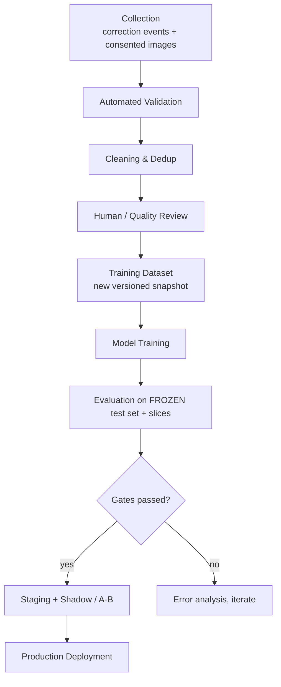

| Stage | Detail |
|---|---|
| **Collection** | Only from users with `training_consent = true` for image use. Corrections without images feed analytics only. |
| **Validation (auto)** | Image decodable, not duplicate (perceptual hash), not near-test-set (leakage guard), plausible correction (quantity within bounds, food exists), user trust score (corrections that flip-flop or are extreme get low weight), privacy filter (faces/PII blur or reject) |
| **Cleaning** | Dedup, normalize labels to canonical `food_id`, drop contradictory pairs, outlier quantity removal |
| **Human review** | Reviewer UI shows image + AI + user label; samples with high-confidence disagreement are prioritized; **agreement of >= 2 signals** (e.g., 3 independent users making the same correction, or reviewer decision) required for label acceptance; inter-reviewer agreement tracked |
| **Training dataset** | Immutable DVC snapshot; test set never receives feedback data automatically |
| **Training/Evaluation/Deployment** | Sections 25-26 and Phase 9 |

## 23.4 Abuse and poisoning defenses
Rate-limit correction volume, per-user trust scoring, ignore bulk contradictory edits, require review before any label enters training, and keep a clean, curated "golden" validation set that user data cannot touch.

## 23.5 Routing corrections by cause **[PROPOSED]**
A `food_changed` or `variant_changed` event can have different causes, which feed different fixes:

| Likely cause | Evidence | Fix path |
|---|---|---|
| Visual misrecognition | Correct food not among classifier Top-K visual classes | Reviewed images -> visual-class training data (retraining) |
| Mapping error | Correct visual class but wrong canonical food/variant selected | Identity-map update (**no retraining**) after review |
| Variant ambiguity | User switches among variants of the same canonical food | Default-variant/weight tuning; variant-selection UX |
| Taxonomy gap | User searches and adds a food not in map | New canonical food/visual class process (Section 24.7) |

This routing is part of the human/quality review step; raw corrections never directly modify maps or training sets.

---

# 24. ML Data Pipeline

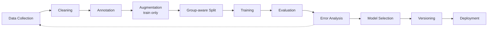

## 24.1 Data collection (sources) **[PROPOSED]**
| Source | Use | Notes |
|---|---|---|
| Existing public Indian-food datasets (e.g., IndianFood10/20 style sets, Kaggle collections, Food-101 subset for non-Indian) | Bootstrapping | **Check license and label quality** before use **[OPEN]**; treat as noisy |
| Web-scraped images (via licensed/permissible sources) | Coverage | Legal review required; prefer CC-licensed |
| **Own capture program** | Core high-quality data | Structured collection with volunteers/restaurants/homes, mobile uploads with weighed portions |
| Crowd-sourced contributors | Scale | Contributor agreement and quality checks |
| App feedback (Phase 9) | Continuous | Consented + reviewed only |
| Synthetic / generative augmentation | Rare classes **[TBV]** | Only supplementary, never in test sets |

## 24.2 Dataset standards **[CONFIRMED]**
- Every image has: `image_id`, `source`, `license/consent`, `capture_context` (home/restaurant/street/packaged), `device`, `lighting`, `region_tag`, `annotator_ids`, `label_version`.
- Labels are **visual class IDs** from the versioned **visual labelset** (never nutrition IDs); label guide with visual definitions and examples per class. Canonical food is derived later through the identity map.
- Minimum class size for inclusion in production label set: **[ASSUMPTION]** >= 300 train images, >= 50 val, >= 50 test, from >= 30 distinct meals/sources. Classes below threshold are marked `beta` (shown with lower confidence ceiling) or grouped.
- Test set: **frozen**, curated by humans, stratified by slice, never used for tuning, versioned separately.

## 24.3 Preventing data leakage **[CONFIRMED]**
| Leak type | Prevention |
|---|---|
| Near-duplicate images across splits | Perceptual hashing (pHash/dHash) and embedding-similarity dedup before splitting |
| Same meal/plate photographed several times | **Group split** by `meal_id` / `session_id` / contributor, not by image |
| Same restaurant/home across splits | Group by `source_id`; hold out whole sources in the test set for generalization estimate |
| Augmented copies leaking | Augment **after** the split, train only |
| Tuning on test set | Test touched only at release evaluation; separate validation for tuning; rotating "challenge" test set |
| Feedback data entering test | Policy: feedback data goes to train/val only |
| Pretraining overlap (e.g., Food-101 in backbone pretraining) | Document and measure with held-out Indian-only set |

## 24.4 Challenges and mitigation

| Challenge | Mitigation |
|---|---|
| **Class imbalance** | Class-balanced sampling, focal/LDAM loss, targeted collection, per-class metrics, hierarchical fallback |
| **Regional variation** | Region tags, collect each dish across regions, region-sliced evaluation, aliases |
| **Lighting variation** | Photometric augmentation, collect dim/yellow indoor light, exposure warning in app |
| **Camera variation** | Many device models; JPEG compression/resolution augmentation; evaluate by device tier |
| **Background variation** | Segmentation-masked crops, background augmentation, copy-paste augmentation |
| **Food presentation** | Plate type/bowl/banana-leaf/tiffin diversity, angle variety (top-down, 45°) |
| **Restaurant vs home** | Context tag, separate slices, variant handling in nutrition layer |
| **Multiple foods** | Detector + segmentation, thali-specific data |
| **Occlusion** | Random erasing/cutout, occluded-labeled examples, confidence reduction rule |
| **Similar classes** | Fine-grained training, hard-negative mining, confusion-pair targeted data, merge-if-indistinguishable policy, hierarchical outputs |

## 24.5 Augmentation (train only)
Random resized crop (conservative scale to avoid dropping the food), flip, small rotation, color jitter and white-balance shifts, blur, JPEG artifacts, noise, random erasing, copy-paste of food instances onto new plates/backgrounds (detector), MixUp/CutMix (classifier, **TBV** for fine-grained classes).

## 24.6 Adding a new food class (process)

*Revised: steps 5-8 concern the **visual** class; identity-map and nutrition steps follow Section 16A.6.*
1. Detect gap (unknown_food logs, search misses). 2. Define canonical food, aliases, taxonomy slot, nutrition profile. 3. Collect >= threshold images. 4. Annotate and QA. 5. Bump `labelset_version`. 6. Retrain/fine-tune classifier (head extension). 7. Evaluate old-class regression. 8. Release with nutrition DB entry shipped **first** (no recognized food without nutrition).

## 24.7 Data-driven taxonomy growth **[CONFIRMED]**
The initial taxonomy is **small, high-quality and representative**; its exact size is **TBV** and is not fixed at 150-300. Priority order: *high-quality labels + reliable nutrition mapping + representative coverage* over *maximum number of classes*.

**Selection criteria for initial classes:** frequently consumed foods; availability of reliable nutrition data; representative regional coverage; visual distinguishability (indistinguishable dishes share a visual class and are separated by the resolver); sufficient dataset availability.

**Expansion is driven by:** real-world usage (unknown-food and search-miss logs), model error analysis, user-correction frequency, dataset availability, nutrition-data quality, regional coverage gaps, and visual distinguishability.

**Versioning:** `visual_labelset_version` and `identity_map_version` are independent of `nutrition_db_version`. New classes are added via head extension or fine-tuning without breaking existing nutrition architecture; old analyses stay resolvable. Each expansion cycle re-runs the slice evaluation (Section 26.6) to confirm no regression.

---

# 25. Model Training Pipeline

## 25.1 Components
| Concern | Tool | Purpose |
|---|---|---|
| Framework | PyTorch (+ PyTorch Lightning or plain loops, **TBV**) | Training |
| Detection training | Ultralytics-compatible or MMDetection/Detectron2 (license-driven choice, **OPEN**) | Detector |
| Experiment tracking | **MLflow** (tracking + registry), optionally **Weights & Biases** if the team prefers hosted dashboards (**one of them is enough**; recommendation: MLflow self-hosted for registry + W&B optional for rich visualization) | Reproducibility |
| Data versioning | **DVC** | Dataset snapshots tied to git commits |
| Config | Hydra/YAML configs in git | Reproducible runs |
| Compute | Cloud GPU (spot instances for training); single A10/L4/A100 sufficient for MVP | Training |
| Export | ONNX (opset pinned) + numerical parity tests | Deployment |
| Packaging | Container image with model artifact + `model_card.md` | Deployment |

**Tooling introduction policy [CONFIRMED]:** MLflow, DVC and W&B are **optional and phase-dependent**. Until adopted, a minimal equivalent is used: git-tracked configs and split manifests with checksums, a committed results table, and model files in object storage with a model card. **MLflow** is introduced when experiment/model-tracking complexity justifies it (multiple concurrent experiments or candidate models; at the latest Phase 9 for the registry). **DVC** is introduced when dataset/model versioning needs exceed manifests (growing datasets, multiple dataset versions, Phase 3-9). W&B is not required. The pipeline is written so these tools can be plugged in later without redesign.

## 25.2 Training procedure (classifier example)
1. Pull dataset version `ds-v{N}` via DVC; verify checksums and split manifest.
2. Stage 1: freeze backbone, train head (few epochs). Stage 2: unfreeze with layer-wise LR decay.
3. AdamW, cosine schedule with warmup, label smoothing 0.1, EMA weights, mixed precision.
4. Early stopping on validation macro-F1 and ECE.
5. Post-hoc temperature scaling on validation set.
6. Evaluate on test set only at the end; log all metrics and slices to MLflow.
7. Export ONNX; run parity test (PyTorch vs ONNX within tolerance); run latency benchmark on target hardware.
8. Register candidate in MLflow (`stage=staging`) with the model card.

## 25.3 Model card (required per model)
Intended use, training data (dataset version), label set, metrics by slice, known failure modes, calibration, latency, hardware, license, date, owner.

## 25.4 Promotion rule **[CONFIRMED]**
A model replaces production only if it (a) beats current on the frozen test set overall, (b) does **not regress** beyond tolerance on any critical slice, (c) meets latency/size budget, (d) passes regression and golden-image tests, and (e) survives shadow/A-B evaluation (Phase 9).

---

# 26. Model Evaluation

## 26.1 Metrics by component

| Component | Metrics | Why distinct |
|---|---|---|
| Classification | Top-1, Top-3, precision/recall/F1 (macro and per-class), confusion matrix, ECE, selective accuracy | Identity only |
| Detection | mAP@0.5, mAP@0.5:0.95, IoU, precision, recall, major-item recall | Localization/coverage |
| Segmentation | Mask IoU, Dice, boundary-F | Quality of region used for portion/classification |
| Portion | MAE, RMSE, MAPE, MdAPE, % within ±20%/±30%, bias | Quantity only (given true class) |
| Nutrition | Absolute kcal error, % kcal error, protein/carb/fat absolute and % error | Combined effect of identity + portion + DB |
| Micronutrients | Error only where reference exists; coverage % | Data-limited |
| Meal-level | Success rate (see 26.3) | End-user outcome |

## 26.2 Target ladder **[PROPOSED; targets are goals, final values set after baselines, TBV]**

| Metric | Dev (Phase 3-6) | MVP | Production / long-term |
|---|---|---|---|
| Classification Top-1 on the **common-foods slice** (frozen test, current visual labelset) | >= 80% | >= 90%, with per-slice floors (26.6) | Slice-defined targets; **95-98% is a long-term aspiration only**, kept only where benchmark results support it |
| Top-3 | >= 92% | >= 97% | >= 99% |
| Detection mAP@0.5 (coarse classes) | >= 0.70 | >= 0.85 | >= 0.92 |
| Major-item recall | >= 85% | >= 92% | >= 96% |
| Segmentation mask IoU *(only if segmentation is adopted)* | >= 0.65 | >= 0.75 | >= 0.82 |
| Portion MdAPE (given true class) | <= 35% | <= 25% | <= 15-20% |
| Portion within ±30% | >= 55% | >= 70% | >= 80% |
| Calorie MdAPE per meal (uncorrected) | <= 35% | <= 25% | <= 15-20% |
| Calorie error after user correction | n/a | Dominated by DB/recipe variance | Reported separately |
| ECE (classifier calibration) | <= 0.10 | <= 0.05 | <= 0.03 |

**Note:** Portion and calorie targets are *deliberately looser* than classification targets because of the physics and recipe uncertainty described in Sections 2 and 17. Calorie error after correction is bounded below by nutrition-data variance (the true calories of a restaurant "dal tadka" can differ ±30% from DB value).

## 26.3 Meal-level success rate (methodology)
Define on a **realistic benchmark of weighed Indian meals** (**TBV**: >= 500 meals, stratified by single-plate vs thali, home vs restaurant, with kitchen-scale ground truth and expert-computed nutrition).

A meal is a **success** if all hold:
1. **Identity:** every *major* item (defined as >= 10% of meal calories or >= 15% of plate area) is correctly identified (Top-1), and no more than one spurious item >50 kcal.
2. **Portion:** each major item's weight within ±30% (±20% for production target).
3. **Nutrition:** total calories within ±20% of ground truth (MVP), protein/carb/fat each within ±25%.

Report: strict success rate, plus graded scores (e.g., 3-of-3 criteria, 2-of-3), and the distribution of calorie error (not only the mean). The thresholds are **parameters in the benchmark config**, tuned with nutrition and product input rather than set arbitrarily; changes are versioned so history stays comparable. Additionally report **"assisted success"**: success after simulated minimal user corrections, and **time-to-correct** from UX tests.

## 26.4 Evaluation slices (mandatory reporting)
Single plate vs thali; home vs restaurant; lighting (bright/indoor/dim); device tier; region; dish group; countable vs bowl vs heap; occluded vs clear.

The mandatory slice list and reporting rules are defined in Section 26.6.

## 26.5 Online metrics (post-launch)
Correction rate per food, per-item acceptance without edits, portion edit magnitude distribution, scan-to-save time, unknown-food rate, low-confidence rate, retention of scanning users.


## 26.6 Slice-based evaluation strategy **[CONFIRMED]**

95-98% is **not** a blanket target. Accuracy is reported separately for: **A** food recognition/classification, **B** food detection, **C** portion estimation, **D** nutrition/calorie estimation, **E** end-to-end meal level. No single "overall system accuracy" number is published.

**Mandatory recognition slices** (each reported on its own):

| Slice | Definition |
|---|---|
| Common foods | High-frequency staples (rice, roti, dal, common sabzi) |
| Visually similar foods | Curated confusion-pair sets (e.g., red-gravy paneer dishes, dal families) |
| Regional Indian foods | By region tag |
| Mixed dishes | Biryani, khichdi, pulao, stuffed items |
| Thali / multi-food meals | Several touching items |
| Lighting | Bright, indoor, dim, warm |
| Camera angle | Top-down, 45 degrees, oblique |
| Plating style | Plate, katori/bowl, tiffin, leaf, takeaway container |
| Occluded foods | Partial occlusion |
| Low-quality images | Blur, noise, low resolution |
| Unseen / out-of-distribution foods | Foods not in the visual labelset |

**Reported for every slice:** Top-1, Top-3, precision, recall, F1 (macro), confusion matrix, per-class performance, ECE/calibration, and for the OOD slice AUROC and false-accept rate. Detection reports mAP/IoU/recall per slice; portion reports MAE, RMSE, MAPE where appropriate and MdAPE per food type; meal-level metrics follow 26.3.

**Rules:**
1. A high aggregate score must not hide poor performance on important categories: release gates include per-slice floors and per-class floors for critical staples (values TBV after baselines), and both frequency-weighted and macro averages are reported.
2. Slices with too few samples (threshold TBV) are flagged "insufficient evidence" rather than reported as a confident number; bootstrap confidence intervals are shown.
3. Targets in 26.2 are goals set after baselines; they are never presented as achieved without a benchmark run on the frozen test set.

## 26.7 Detection, segmentation and identity-resolution evaluation
- **Detection:** mAP, IoU, detection recall, major-item recall, false positives per image, per slice.
- **Segmentation (only if adopted):** mask IoU/Dice plus the ablation in Phase 4: detection-only vs detection+segmentation compared on detection recall, food-item separation accuracy, mask IoU, portion-estimation error, latency and compute cost. Segmentation becomes a production dependency **only** if the measured benefit is sufficient (ADR-010).
- **Identity resolution:** canonical-food top-1/top-3 accuracy, variant accuracy where ground truth exists, ambiguity rate, map coverage; reported separately from visual classification accuracy.

## 26.8 Nutrition engine evaluation and error attribution
- **Nutrition engine alone:** given ground-truth canonical food, variant and grams, compare outputs to nutritionist-verified reference data (tables and golden meals). Expect deterministic agreement within rounding; also run data-quality checks (Atwater consistency, non-negativity, unit sanity, micronutrient coverage).
- **Error attribution by oracle substitution** on the weighed-meal benchmark:

| Run | Identity | Portion | Remaining error attributed to |
|---|---|---|---|
| Full prediction | predicted | predicted | all stages combined |
| Oracle identity | ground truth | predicted | portion + data variance |
| Oracle portion | predicted | ground truth | recognition/identity + data variance |
| Both oracle | ground truth | ground truth | nutrition data/recipe variance (floor) |

- **End-to-end:** meal-level success metrics (26.3), reported separately, never merged into one accuracy figure.

---

# 27. Error Handling

**[CONFIRMED]** Principle: *degrade gracefully, never dead-end.* Every failure leaves the user a path to log the meal (manual search is always available).

| Scenario | Detection | System behavior | User message / UX |
|---|---|---|---|
| Poor image quality (blur/dark/glare) | Laplacian variance, exposure histogram, resolution | If severe: reject with `LOW_QUALITY_IMAGE`; if mild: proceed with warning | "The photo looks blurry. Retake for better results?" with Retake / Analyze anyway |
| Food partially hidden | Occlusion flag, low mask coverage | Lower confidence; flag item | "Part of this item is hidden. Please check the quantity." |
| Unknown food | OOD score high, low Top-1 | Mark `unknown`; log for taxonomy | "We couldn't recognize this item. Search to add it." |
| Ambiguous variant / preparation | Resolver reports `ambiguity=variant` or low identity confidence | Default variant, calorie range widened, variant chips | "Which version is this? Pick the closest one." |
| Low confidence | Top-1 below threshold or small margin | Top-3 presented | "We're not fully sure about this food. Please select from these options." |
| Overlapping foods | Low detector separation, merged mask | Allow split/add; reduce confidence | "These items are close together. Tap to adjust." |
| Portion cannot be estimated | No mask / no scale / regressor failure | Default serving + low portion confidence | "We couldn't estimate the amount. We've used a standard serving - please adjust." |
| Nutrition data unavailable | Missing profile or nutrient | Show available nutrients; mark missing; calorie from nearest category fallback flagged `estimated` | "Nutrition data isn't available for X yet. Values shown are approximate." |
| API failure (5xx) | HTTP errors | Retry with exponential backoff (idempotency key); preserve draft | "Something went wrong. Try again" + manual log option |
| AI model failure/unavailable | Inference exception, health check | Circuit breaker; fall back to previous model version (if configured); else 503 | "Food recognition is temporarily unavailable. You can search and log manually." |
| Database failure | Connection errors | Readiness probe fails, 503, read-only mode if replica available, alert | "We're having trouble saving. Your draft is stored on this device." |
| No network | Connectivity check/timeout | Queue meal saves locally; scanning disabled (V1) | "You're offline. You can still view your diary and add foods manually; we'll sync later." |
| Upload interrupted | Timeout | Resumable retry; compress further | Progress + retry |
| Inference timeout | Server-side deadline | `504`; optional async path | "This is taking longer than usual." |
| Conflicting sync edits | Version/ETag mismatch | Last-write-wins with updated_at; warn on meals | Subtle notice |

**Backend rules:** structured error codes, correlation `request_id` in every log and response, no stack traces to clients, Sentry-style capture, per-stage timeouts, circuit breakers around the inference adapter.

---

# 28. Security and Privacy

## 28.1 Security controls

| Area | Controls |
|---|---|
| **Authentication** | Email-OTP and/or Google/Apple Sign-In (no password storage in V1 -> reduces risk). Short-lived JWT access (15 min), rotating refresh tokens bound to device, revocation list, secure storage on device (Keychain/Keystore). |
| **Authorization** | Object-level checks on every resource (`resource.user_id == token.sub`), role claims for admin/reviewer, deny-by-default. Tests for IDOR. |
| **Transport** | HTTPS only (TLS 1.2+), HSTS, certificate pinning considered in Phase 11 (**TBV** because pinning complicates rotation). |
| **API security** | Pydantic strict validation, size limits, CORS locked down, rate limiting per user/IP, idempotency keys, request-ID tracing, OpenAPI exposure disabled in production or protected. |
| **Image security** | MIME sniffing (not trusting extension), decode via hardened library in sandboxed worker, dimension/pixel-count caps (decompression-bomb protection), EXIF/GPS strip, re-encode, optional malware scan for uploads (**TBV**), no direct public URLs (signed, short-TTL). |
| **Storage security** | Private buckets, SSE encryption, least-privilege IAM, separate buckets for user images vs training data, access logging. |
| **Database security** | Encryption at rest, TLS to DB, least-privilege DB roles, parameterized queries (ORM), automated backups encrypted, restricted network access, secrets via manager (not env files in git). |
| **Secrets** | Cloud secret manager; rotation; CI secret scanning. |
| **Supply chain** | Dependency pinning, `pip-audit`/`npm`/`dart pub` audits, container image scanning, SBOM, signed builds. |
| **Model/API abuse** | Per-user quotas for `/food/analyze` (e.g., 30/hour **TBV**), anomaly detection, cost guards (GPU), bot protection (app attestation: Play Integrity / App Attest in Phase 11), adversarial-input resilience (input sanitization; models are not safety-critical but poisoning handled in Section 23.4). |
| **Mobile app** | Obfuscation (release builds), no secrets in app, root/jailbreak awareness (soft), secure local DB (SQLCipher **TBV**), screenshot protection not needed. |
| **Logging** | No raw images/tokens/PII in logs; pseudonymous IDs. |
| **Admin tools** | SSO + MFA, audit log, reviewer access restricted to consented training samples. |

## 28.2 Privacy design **[CONFIRMED principles]**
- **Minimal collection:** only data needed for the feature; profile fields optional; no contacts, no precise location, no ad IDs.
- **Images are not kept forever.** Retention classes (Section 20.1): analysis-only images purge automatically; images tied to saved meals kept while the meal exists (user may choose "don't store my photos", then only a thumbnail or nothing is kept - **[OPEN]** product decision).
- **Training use requires explicit opt-in** (separate toggle, off by default, revocable; revocation removes future use and triggers removal from future dataset versions).
- **User rights:** export my data (JSON/CSV), delete my account and all data within a defined SLA (e.g., 30 days, with immediate soft-delete), view and delete individual meals/images.
- **Compliance:** India **DPDP Act 2023** consent/notice/erasure expectations; GDPR-aligned practices if serving EU; Apple/Google store privacy labels; privacy policy and in-app consent text. **Legal review required [OPEN]**.
- **Health-data caution:** meal logs can imply health conditions; treated as sensitive; no sharing with third parties; analytics aggregated/pseudonymized.
- **Children/medical disclaimer:** app provides estimates, not medical advice; age gate (13+ or per local law, **OPEN**).

## 28.3 Threat model summary (STRIDE-lite)
| Threat | Example | Mitigation |
|---|---|---|
| Spoofing | Stolen token | Short TTL, rotation, device binding |
| Tampering | Client sends fake nutrition totals | Server recomputes totals |
| Repudiation | Disputed deletion | Audit log |
| Information disclosure | IDOR on images | Object-level auth, signed URLs |
| DoS | Flood of analyze requests | Rate limiting, quotas, queue |
| Elevation | Reviewer privileges abuse | RBAC, audit, MFA |
| Poisoning | Malicious corrections | Review pipeline, trust scores |

---

# 29. Performance

## 29.1 Targets (Dev / MVP / Production) **[PROPOSED, TBV by measurement]**

| Metric | Development | MVP | Production |
|---|---|---|---|
| Upload image size (after client compression) | <= 3 MB | <= 1.5 MB | <= 1 MB (long edge about 1024-1280 px) |
| Upload time (4G, ~5 Mbps) | n/a | <= 2 s | <= 1.5 s |
| Image validation + preprocessing | <= 300 ms | <= 150 ms | <= 80 ms |
| Detection inference (server GPU) | <= 400 ms | <= 150 ms | <= 60 ms |
| Segmentation *(only if adopted after the Phase 4 ablation)* | <= 600 ms | <= 250 ms | <= 100 ms |
| Classification (all items) | <= 300 ms | <= 150 ms | <= 60 ms |
| Food Identity Resolution (all items) | <= 20 ms | <= 10 ms | <= 5 ms |
| Portion estimation | <= 800 ms | <= 300 ms | <= 120 ms |
| Nutrition calc + DB | <= 100 ms | <= 50 ms | <= 30 ms |
| **API `/food/analyze` p50 / p95** | <= 6 s / 10 s | <= 3 s / 5 s | <= 2 s / 3.5 s |
| **End-to-end scan (tap Analyze -> result visible)** | <= 8 s | <= 4.5 s | <= 3 s (p50) |
| Typical API (CRUD) p95 | <= 800 ms | <= 400 ms | <= 250 ms |
| DB query p95 (indexed) | <= 100 ms | <= 50 ms | <= 20 ms |
| Recalculation after edit (local) | <= 300 ms | <= 100 ms | <= 50 ms (instant feel) |
| Mobile memory (scan flow peak) | <= 500 MB | <= 350 MB | <= 250 MB |
| Mobile app size (no on-device model) | <= 80 MB | <= 60 MB | <= 50 MB |
| On-device model size (if Phase 10 selects) | n/a | n/a | <= 30-50 MB total (quantized) |
| Battery: one scan | n/a | <= 1.5% battery | <= 0.7% |
| Network data per scan | <= 4 MB | <= 2 MB | <= 1.2 MB |
| Backend throughput | 1-5 req/s | 10-20 req/s per GPU worker | Autoscaled (**TBV**) |
| Availability | n/a | 99.0% | 99.5%+ |

## 29.2 Performance engineering levers
Client compression, WebP/JPEG tuning, ONNX Runtime with FP16, TensorRT, batching classifier crops, caching nutrition lookups, async path fallback, warm model pools, GPU autoscaling, CDN for static, DB indexes (`meal(user_id, local_date)`, trigram on alias).

---

# 30. Testing Strategy

## 30.1 Test pyramid

| Level | Scope | Tools |
|---|---|---|
| **Unit** | Nutrition calculations, unit conversion, rounding, portion math, API validators, DB repositories, taxonomy/alias mapping, confidence combination, Dart BLoC/use-cases | `pytest`, `hypothesis` (property tests), `flutter_test`, `bloc_test` |
| **Integration** | Mobile -> API -> AI -> DB with test containers; migrations; object storage (MinIO) | `pytest` + `testcontainers`, `httpx`/`TestClient`, Flutter integration tests against staging |
| **ML tests** | Classification (frozen test set), detection, segmentation, portion; regression tests; model version comparison; ONNX parity; calibration; slice reports; invariance tests (brightness, crop jitter, small rotation); directional tests | Custom eval harness, MLflow, golden sets |
| **Contract tests** | OpenAPI schema and Pydantic models vs mobile DTOs | `schemathesis`, generated clients |
| **E2E** | Full user flows on real devices/emulators | Flutter `integration_test`, Patrol/Maestro/Appium (**TBV**) |
| **Performance/load** | Latency under load, GPU saturation | `locust`/`k6` |
| **Security** | SAST/DAST, dependency scan, authz tests | `bandit`, `semgrep`, OWASP ZAP, `pip-audit` |
| **UAT** | Realistic Indian meals with real users | Structured sessions |

## 30.2 Required unit-test examples
- 2 rotis x 40 g/roti -> 80 g; kcal = per100g x 0.8.
- Unit round-trip: 1 katori -> g -> katori yields the original.
- Additivity: totals(A+B) = totals(A)+totals(B).
- Missing micro never becomes 0 in totals; `partial` flag set.
- Quantity bounds, unknown unit, unknown food errors.
- Rounding policy deterministic.
- Identity resolution: alias resolution (chapati/roti), map weights sum to 1 per visual class, every shipped visual class has a mapped food with a complete profile, old `identity_map_version` still resolves, variant default and range behavior, resolver never emits a visual class ID as `food_id`.

## 30.3 ML regression and comparison
- **Golden image set** (about 200 hand-picked images) with expected outputs; CI runs inference to detect unintended changes.
- **Model comparison report** (candidate vs production) on frozen test set + slices with bootstrap confidence intervals; statistical significance required for promotion.
- **Behavioral tests:** same food under brightness/contrast changes, crop variations, plate changes; ensure predictions are stable.
- **Latency/size gates** in CI for model artifacts.

## 30.4 End-to-end scenario
```text
Take photo -> Analyze -> Verify -> Correct (change food + quantity) -> Save
-> Daily total updated (assert exact equals sum of saved meal items)
-> Correction event present in DB -> Analysis linked to meal
```

## 30.5 User acceptance testing (UAT)
- 30-50 participants across regions, ages, device tiers.
- **Realistic Indian meals:** home-cooked thalis, tiffins, restaurant dishes (North/South/East/West Indian), street snacks, sweets, beverages.
- Tasks: scan, correct, save, review diary. Measure: scan success, correction effort/time, trust/clarity of confidence UI, perceived accuracy.
- Weighed-meal sessions with a dietitian to compare against ground truth.
- Exit: meets MVP thresholds in Section 26 and usability targets (e.g., >= 80% complete scan-to-save unaided; SUS >= 75, **TBV**).

## 30.6 Coverage targets
Nutrition engine >= 90% line coverage; backend core >= 80%; mobile business logic >= 80%; every API endpoint has contract and negative tests.

---

# 31. Deployment Architecture

## 31.1 Environments
`local` (docker-compose) -> `dev` -> `staging` (prod-like, synthetic + test data) -> `production`. Infrastructure as code (Terraform). Config via env + secret manager.

## 31.2 V1 topology **[PROPOSED]**

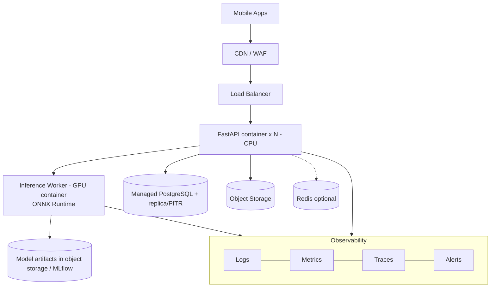

## 31.3 Inference strategy comparison (ADR-003)

| Option | Latency | Cost | Privacy | Update speed | Offline | Complexity | Verdict |
|---|---|---|---|---|---|---|---|
| **Cloud inference (GPU)** | Network + 0.5-1.5 s compute | GPU cost scales with usage | Images leave device | Instant model updates | No | Low-Med | **V1 choice** |
| **On-device (TFLite/Core ML)** | Low, no network | No server GPU | Strong | Needs app/model updates | Yes | High (two runtimes, quantization, accuracy loss) | Evaluate Phase 10 |
| **Hybrid** | On-device lightweight (detect/quality/coarse classify), cloud for fine classification + portion | Balanced | Medium | Mixed | Partial | Highest | **Likely end state candidate, TBV** |

Phase 10 decides with data: accuracy drop after quantization, latency on mid-range Android, battery, model size.

## 31.4 Compute and scaling
- **API:** stateless containers on managed container platform (Cloud Run/ECS/Kubernetes - **[OPEN]** choose by team skills; start simple, Kubernetes only if required).
- **GPU inference:** start with a single GPU instance (L4/T4/A10); autoscale on queue depth/latency; scale-to-zero for dev; cold-start mitigation by min-instances in production.
- **Database:** managed PostgreSQL, connection pooling (PgBouncer), read replica when needed, PITR backups.
- **Queue:** introduce Redis + worker only for async scans/feedback jobs when the synchronous path fails defined latency/scalability requirements (Section 32.1).
- **Batch jobs:** retention purge, feedback validation, dataset builds, model evaluation (scheduled).

## 31.5 CI/CD
GitHub Actions: lint (ruff, black, mypy; `dart analyze`, `flutter format`), unit tests, build containers, security scans, migration checks, staging deploy on main, manual-approved prod deploy, **mobile**: Fastlane + Play Console internal track / TestFlight, staged rollout. **ML CI:** training/eval pipelines triggered manually or on dataset change; promotion via registry stage change plus checklist.

## 31.6 Observability
- **Logs:** structured JSON, request IDs.
- **Metrics:** latency histograms per pipeline stage, error rates, GPU utilization, queue depth, model confidence distributions.
- **Tracing:** OpenTelemetry across API -> inference.
- **Model monitoring:** input drift (image statistics/embeddings), prediction distribution shift, OOD rate, confidence calibration drift, correction rate per food/model version, alert thresholds.
- **Crash reporting:** Sentry/Firebase Crashlytics on mobile and backend.
- **Alerting:** SLO-based (availability, p95 latency, error rate).

## 31.7 Backup and DR
Daily snapshots + PITR (RPO <= 15 min, RTO <= 4 h for MVP, **TBV**), object-storage versioning for datasets/models, tested restore drills quarterly.

## 31.8 Model rollout
Registry stage `staging` -> **shadow mode** (run candidate in parallel, log disagreements) -> **A/B or canary (5% -> 25% -> 100%)** -> rollback by switching registry pointer (no app release needed). All records carry `model_versions`.

---

# 32. Technology Stack

| Layer | Technology | Purpose | Why selected | Alternatives considered | Phase |
|---|---|---|---|---|---|
| Mobile | **Flutter 3.x / Dart** | Cross-platform app | One codebase, strong camera/UI, large ecosystem | Native Kotlin+Swift (best ML/camera integration, 2x cost), React Native, KMP | 1 |
| Mobile state | **Riverpod or BLoC** (TBV) | State management | Testable, scalable | Provider, GetX | 1 |
| Mobile net | `dio`, `retrofit`/OpenAPI generated client | HTTP | Interceptors, retries | `http` | 1 |
| Mobile storage | `drift` (SQLite), `flutter_secure_storage` | Local cache, tokens | Typed queries, secure | Isar, Hive | 1/8 |
| Mobile camera | `camera`, `image_picker`, `flutter_image_compress` | Capture/compress | Standard | native plugins | 6 |
| Backend lang/framework | **Python 3.11+, FastAPI, Pydantic v2, Uvicorn/Gunicorn** | API | Python-ML synergy, typed, async, OpenAPI | Django REST (heavier), Flask, Node/Go (poor ML fit) | 1 |
| ORM/migrations | SQLAlchemy 2, Alembic | DB access | Mature | SQLModel, Tortoise | 1 |
| Auth | JWT (`pyjwt`), OAuth providers, OTP via email/SMS provider | Auth | Standard | Firebase Auth/Auth0/Supabase (**TBV**: managed auth reduces risk and effort) | 1 |
| Database | **PostgreSQL 16** (+ `pg_trgm`, JSONB) | System of record | Relational integrity, JSONB for micros, fuzzy search | MongoDB (rejected: nutrition/meals are relational; see ADR-006) | 1/2 |
| Object storage | **S3 / GCS / MinIO (local)** | Images, artifacts | Standard, lifecycle rules | DB blobs (rejected) | 3/6 |
| Cache/queue | **Redis** only if justified | Rate limit, async jobs, cache | Common | In-memory, SQS | 6/11 |
| ML framework | **PyTorch**, torchvision, `timm` | Training | Ecosystem, pretrained models | TensorFlow | 3 |
| Vision utils | **OpenCV**, Pillow, Albumentations | Preprocess/augment | Standard | Kornia | 3 |
| Detector | **YOLO-family / RT-DETR** (license-checked) | Detection | Speed/accuracy | Faster R-CNN, DETR | 4 |
| Segmenter | **MobileSAM/SAM2 or YOLO-seg** *(optional, experimental; adopted only if the Phase 4 ablation justifies it)* | Masks | Promptable, fewer labels | Detection-only baseline, Mask2Former, U-Net | 4 (ablation) |
| Classifier | **EfficientNetV2 / ConvNeXt / ViT-DINOv2** (TBV) | Identity | Accuracy/latency tradeoff | ResNet, MobileNet (distill target) | 3 |
| Embeddings | **OpenCLIP/SigLIP** | OOD, pre-labeling, retrieval | Strong features | DINOv2 | 3/9 |
| Depth | **Depth Anything V2 / MiDaS** (TBV) | Portion cue | Good relative depth | None/LiDAR (future) | 5 |
| Inference runtime | **ONNX Runtime (GPU)**, TensorRT optional, Triton optional | Serving | Portability, speed | TorchServe, BentoML | 6/10 |
| On-device | **TFLite / Core ML / ONNX Mobile** (evaluate) | Mobile inference | Native acceleration | ExecuTorch | 10 |
| Experiment tracking *(optional; Section 32.1)* | **MLflow** (+ optional W&B) | Tracking + registry | Self-hostable registry; one primary tool avoids sprawl | W&B only, Neptune | 3 |
| Data versioning | **DVC** | Dataset lineage | Git-integrated, object-store backend | LakeFS, Git-LFS | 3 |
| Annotation | **CVAT / Label Studio** | Labeling | Open-source, boxes+masks | Roboflow, Labelbox (cost) | 3-4 |
| Containers/IaC | **Docker, Terraform** | Deployment | Reproducible | Pulumi | 1/11 |
| CI/CD | **GitHub, GitHub Actions, Fastlane** | Build/test/release | Integrated | GitLab CI | 1 |
| Testing | `pytest`, `hypothesis`, `schemathesis`, `flutter_test`, `integration_test`, `locust` | Quality | Standard | Newman/Postman | 1+ |
| Observability | **OpenTelemetry, Prometheus/Grafana (or cloud-native), Sentry, Firebase Crashlytics** | Monitoring | Standard | Datadog (cost) | 1/11 |
| Code quality | ruff, black, mypy, `dart analyze`, pre-commit | Consistency | Standard | flake8 | 1 |

**Rule:** a tool is added only in the phase where it has a concrete purpose (last column) and when measurable need exists. W&B, Redis, Triton, TensorRT, async queues and on-device runtimes are *conditional* - not part of early phases or the initial MVP.

## 32.1 Optional infrastructure: introduction criteria **[CONFIRMED]**

None of the following is removed from the design; each is optional, phase-dependent, and introduced only after measurable need. The architecture keeps extension points so adding them later requires no redesign.

| Technology | Status | Introduce only when | Interim approach |
|---|---|---|---|
| **MLflow** | Optional | Experiment/model tracking complexity justifies it (multiple candidates, registry/rollback needs); at the latest Phase 9 | Git-tracked configs + results table + model cards |
| **DVC** | Optional | Dataset/model versioning exceeds checksummed manifests (growing/multiple dataset versions) | Versioned manifests with checksums in git; data in object storage |
| **W&B** | Optional, not required | Team wants hosted dashboards beyond MLflow | MLflow or plain logs |
| **Redis** | Optional | Caching/session/rate-limit/queue requirements are demonstrated by measurements (typically Phase 6-11) | In-process cache; DB-backed or gateway rate limiting |
| **Async queue** (Redis + worker) | Optional | Synchronous inference fails the defined latency/scalability requirements | Synchronous `POST /food/analyze` |
| **TensorRT** | Optional | Benchmarks show the selected runtime (ONNX Runtime) cannot meet latency targets | ONNX Runtime (CUDA/FP16) |
| **Triton / separate inference service** | Optional | Multi-model serving or independent scaling is needed | In-process ONNX Runtime worker |
| **On-device runtimes (TFLite / Core ML)** | Evaluated in Phase 10 | Data justify on-device or hybrid inference | Cloud inference |
| **Segmentation model** | Experimental | Phase 4 ablation shows sufficient benefit | Detection-only pipeline |


---

# 33. Phase-wise Development Plan

**Global rules [CONFIRMED]:** (1) Build phase by phase. (2) No phase silently implements a later phase's functionality; stubs/feature flags allowed but behavior must be explicit. (3) Each phase ends at a **Phase Gate** (Section 35). (4) Every phase produces updated docs, tests and artifacts. (5) Phase durations below are indicative **[ASSUMPTION]** for a small team (about 4-6 engineers + 1 ML lead + part-time nutritionist/annotators).

## Phase overview

| Phase | Name | Indicative duration | Key output |
|---|---|---|---|
| 0 | Requirements & SDD | 2-3 weeks | Approved SDD, visual label set + identity map drafts, data plan |
| 1 | Foundation | 3-4 weeks | Running app + API + DB + auth + CI |
| 2 | Nutrition Database & Engine | 4-6 weeks | Manually testable Nutrition API + seeded DB |
| 3 | Single-Food Recognition | 6-8 weeks | Benchmarked classifier + `/food/classify` |
| 4 | Multi-Food Detection | 5-7 weeks | Detector + segmentation + multi-item results |
| 5 | Portion Estimation | 6-8 weeks | Benchmarked portion estimator |
| 6 | Complete Nutrition Pipeline | 4-5 weeks | `/food/analyze` + result screen = first usable scanner |
| 7 | User Verification | 3-4 weeks | Full correction flow |
| 8 | Meal Diary | 3-4 weeks | Saved meals, daily totals, history |
| 9 | Model Improvement Pipeline | 5-6 weeks | Feedback -> retrain -> deploy loop |
| 10 | Mobile Optimization | 4-6 weeks | Latency/size/battery wins; inference decision |
| 11 | Production Readiness | 4-6 weeks | Hardened, monitored, launch-ready |

**MVP completes at the end of Phase 8** (Section 36). Phases 9-11 harden and scale; a limited beta may begin after Phase 8 with Phase 9-lite feedback collection enabled.

> **Plan improvement vs suggested structure [PROPOSED]:** Data collection and annotation for Phases 3-5 start in **Phase 1-2 as a parallel data track** (they are the long-lead items). Also Phase 7 (verification UI) can start its mobile work in parallel with Phase 5-6 using mocked analysis responses, as long as it ships after Phase 6. Both are marked in Section 34.

---

## PHASE 0 - Requirements and SDD

| # | Item | Detail |
|---|---|---|
| 1 | Objective | Agree what to build and how; de-risk the biggest unknowns before code. |
| 2 | Scope | Requirements, architecture, data model, API contracts, ML strategy, dataset strategy, evaluation methodology, risk register. |
| 3 | Features | None (documentation and prototypes). |
| 4 | Technical components | SDD; OpenAPI draft; ERD; visual label set v0 + identity map v0 (small, data-driven candidate list; size TBV); annotation guidelines v0; benchmark protocol; weighed-meal data protocol. |
| 5 | Tech stack | Markdown/Mermaid, Figma (UX), Notion/Jira. |
| 6 | DB changes | Draft ERD only. |
| 7 | API changes | Draft OpenAPI spec (contract-first). |
| 8 | AI/ML | **Feasibility spikes (time-boxed, throwaway):** run a pretrained classifier on 50 sample Indian meal photos; test depth/segmentation on thali photos; license audit of datasets/models (YOLO, IFCT, datasets). |
| 9 | Input | This brief, stakeholder interviews, competitor review, sample meals. |
| 10 | Output | **Approved SDD**, risk register, UX wireframes, data-collection plan, licensing report. |
| 11 | Testing | SDD review by ML, backend, mobile, nutritionist, and legal/privacy reviewers. |
| 12 | Completion criteria | SDD signed off; open questions in Section 39 triaged with owners; visual label set v0 and identity map v0 agreed; legal questions assigned. |
| 13 | Dependencies | None. |
| 14 | Connects to next | Contracts and schema feed Phase 1/2; data plan starts the data track. |
| 15 | Must NOT implement | Production code, model training beyond spikes, UI beyond wireframes. |

## PHASE 1 - Foundation

| # | Item | Detail |
|---|---|---|
| 1 | Objective | Working skeleton of every layer so later phases only add features. |
| 2 | Scope | Repo(s), Flutter app shell, FastAPI app, DB, auth, nav, config, CI/CD, logging, error handling. |
| 3 | Features | Sign-in/sign-up, minimal profile, home dashboard (empty state), settings stub, health endpoints. |
| 4 | Technical components | Monorepo layout `/mobile /backend /ml /infra /docs`; FastAPI modular structure (11.2); Alembic; Docker-compose (api + postgres + minio); error envelope; request-ID middleware; structured logging; Flutter DI/routing/theme/env flavors (dev/staging/prod); OpenAPI-generated client. |
| 5 | Tech stack | Flutter, Dart, FastAPI, Pydantic, SQLAlchemy, Alembic, PostgreSQL, Docker, GitHub Actions, pytest, flutter_test, ruff/mypy. |
| 6 | DB changes | `app_user`, `audit_log`; migration baseline. |
| 7 | API changes | `/auth/*`, `/users/me`, `/health`, `/ready`. |
| 8 | AI/ML | None. Create `/ml` repo skeleton with lightweight experiment conventions only (MLflow/DVC optional, introduced per Section 32.1). |
| 9 | Input | Approved SDD, OpenAPI draft. |
| 10 | Output | Installable app (Android/iOS debug builds) that signs in and calls the API; deployed dev environment; CI green. |
| 11 | Testing | Unit tests for auth, validation; integration test (app -> API -> DB); CI pipeline tests; basic E2E sign-in. |
| 12 | Completion criteria | Fresh clone -> `make dev` runs everything; sign-in works on both platforms; CI builds backend image and Flutter apps; logs and errors are structured; DB migrations reproducible. |
| 13 | Dependencies | Phase 0. |
| 14 | Connects to next | Provides DB/migration/auth/API conventions that Phase 2 extends. |
| 15 | Must NOT implement | Any AI inference, nutrition logic, camera flow, meal storage. |

**Parallel tracks inside Phase 1:** Backend foundation | Mobile foundation | Database/Infra foundation | **Data track kickoff** (annotation tooling, collection protocol, contributor onboarding).

## PHASE 2 - Nutrition Database and Engine

| # | Item | Detail |
|---|---|---|
| 1 | Objective | A trustworthy nutrition core that works **without any AI**. |
| 2 | Scope | Food schema, taxonomy, serving units, conversion, calculation engine, source/provenance, seed data for the Phase-2 canonical food set (size TBV, data-driven) and the identity map. |
| 3 | Features | Food search (alias + fuzzy), food detail, nutrition calculation API, simple "manual food lookup/calculator" screen (also valuable as the later fallback). |
| 4 | Technical components | Normalization module; alias table; **Food Identity Resolver + identity map v1 (deterministic, no ML; Section 16A)**; ingestion scripts (IFCT/USDA/recipe-calc) with provenance; calculation library (pure Python, shared logic mirrored in Dart for local recalculation); data-validation checks (kcal ~ 4P+4C+9F within tolerance, non-negative values, unit sanity); nutritionist review workflow. |
| 5 | Tech stack | PostgreSQL (`pg_trgm`), SQLAlchemy, pandas (ingestion), pytest + hypothesis. |
| 6 | DB changes | `food`, `food_category`, `food_alias`, `food_variant`, `serving_unit`, `nutrition_profile`, `nutrition_source`, `ingredient`, `recipe`, `recipe_ingredient`, plus identity tables `labelset_version`, `visual_class`, `identity_map_version`, `visual_class_mapping`. |
| 7 | API changes | `GET /food/search`, `GET /food/{id}`, `GET /food/{id}/variants`, `POST /food/identity/resolve` (internal), `POST /nutrition/calculate`. |
| 8 | AI/ML | None. (Finalize **visual label set v1 and identity map v1** jointly with ML and nutritionist: each visual class maps to >= 1 canonical food/variant; sizes are TBV and data-driven.) |
| 9 | Input | Source tables (IFCT, USDA), recipes, nutritionist input, visual label set v0 + identity map v0. |
| 10 | Output | Seeded DB for the Phase-2 canonical food set (size TBV, anchored on foods with reliable nutrition data, + ingredients), identity map v1, resolver, versioned `nutrition_db` release, calculation engine, API, manual lookup screen. |
| 11 | Testing | Unit + property tests; golden calculations verified by nutritionist; data-quality report (coverage per nutrient; Atwater consistency); API negative tests. |
| 12 | Completion criteria | Any seeded food + quantity + unit returns correct nutrients with sources; 100% seeded foods have energy+macros; micro coverage report produced; 95% of manual-test queries resolve via alias search; nutritionist sign-off on top-100 dishes. |
| 13 | Dependencies | Phase 1. |
| 14 | Connects to next | Defines canonical foods and the identity map; Phase 3 trains against the **visual labelset** that maps into them through the resolver, and Phase 6 calls the same APIs. |
| 15 | Must NOT implement | Image handling, ML models, meal diary persistence, correction UI. |

## PHASE 3 - Single Food Recognition

| # | Item | Detail |
|---|---|---|
| 1 | Objective | First AI model: one image -> one canonical food + calibrated confidence. Establish the **training/eval/versioning workflow**. |
| 2 | Scope | Small, high-quality visual labelset (initial size TBV, data-driven; not a mandated class count), expanded iteratively per Section 24.7; baseline + challenger models, benchmarking, `/food/classify` dev endpoint. |
| 3 | Features | Dev/internal "Try classify" screen: pick image -> Top-3 predictions. |
| 4 | Technical components | Dataset build (versioned manifests; DVC if needed per 32.1), group-aware splits, training code (Lightning/Hydra), calibration (temperature scaling), OOD scoring, ONNX export, inference adapter v0, MLflow tracking/registry, model card, confusion-pair report. |
| 5 | Tech stack | PyTorch, timm, torchvision, OpenCV, Albumentations, ONNX Runtime, OpenCLIP (embeddings); MLflow/DVC optional (adopted when complexity justifies, Section 32.1). |
| 6 | DB changes | `model_version`, `image` (minimal), `dataset_version/sample` (optional, can be file-based until Phase 9). |
| 7 | API changes | `POST /food/classify` (internal/dev flag). |
| 8 | AI/ML | CNN vs ViT bake-off (ADR-004), visual-labelset granularity vs hierarchy experiments, calibration, OOD; **frozen test set created now**. |
| 9 | Input | Single-food images + visual class labels (visual labelset). |
| 10 | Output | Visual class, Top-3 with calibrated probabilities, OOD flag, resolved canonical food/variant candidates (via the Phase 2 resolver, for debugging), model card, slice-based metrics report. |
| 11 | Testing | Metrics per Section 26 (Top-1/3, F1, confusion, ECE); slice analysis; leakage audit; ONNX parity; latency benchmark; API test. |
| 12 | Completion criteria | Meets **Dev target** (Top-1 >= 80% on the common-foods slice of the frozen test, ECE <= 0.10) with all Section 26.6 slices reported (no aggregate-only reporting); failure cases analyzed and documented; reproducible training from one command. |
| 13 | Dependencies | Phase 2 (label set -> `food_id`), data track. |
| 14 | Connects to next | Classifier becomes the second stage after detection; the training stack is reused for detector/portion. |
| 15 | Must NOT implement | Multi-food detection, portion estimation, nutrition computation from AI output in app, user-facing scanning flow. |

## PHASE 4 - Multi-Food Detection

| # | Item | Detail |
|---|---|---|
| 1 | Objective | One image -> multiple food regions -> per-region classification. |
| 2 | Scope | Detection, region extraction, multi-item result, thali/plate handling; **segmentation evaluated by ablation (optional)**. |
| 3 | Features | Dev screen showing boxes/masks + per-item Top-3 (still no portions/nutrition from AI). |
| 4 | Technical components | Annotation (boxes + masks); detector training; **optional** segmenter integration (box-prompted, experimental); crop (and mask if adopted) pipeline feeding classifier; **ablation harness: detection-only vs detection+segmentation**; NMS tuning; pipeline orchestrator v0 (`RecognitionService`); fallback logic. |
| 5 | Tech stack | YOLO-family/RT-DETR, MobileSAM/SAM2 or YOLO-seg, OpenCV, CVAT, ONNX Runtime. |
| 6 | DB changes | `analysis`, `prediction_item` (detection + classification fields). |
| 7 | API changes | `POST /food/detect`; extend `/food/classify` to region input; pipeline v0 in dev. |
| 8 | AI/ML | Detector (coarse classes); **segmentation ablation** (detection-only vs detection+segmentation on detection recall, item-separation accuracy, mask IoU, portion error, latency, compute cost); classifier on masked crops vs box crops comparison; decision recorded in ADR-010. |
| 9 | Input | Multi-food images with boxes/masks. |
| 10 | Output | List of items `{bbox, mask (null in detection-only baseline), coarse_class, top_k visual classes, resolved canonical food/variant candidates, confidences}`. |
| 11 | Testing | mAP, IoU, major-item recall, mask IoU/Dice; thali slice; end-to-end item-level accuracy; failure tests (zero detections, overlaps). |
| 12 | Completion criteria | Dev targets: mAP@0.5 >= 0.70, major-item recall >= 85%; mask IoU >= 0.65 only if segmentation is adopted; **segmentation ablation report completed and adoption decision recorded**; multi-item pipeline p50 within dev latency; failure fallbacks working. |
| 13 | Dependencies | Phase 3. |
| 14 | Connects to next | Regions (boxes; masks if segmentation is adopted) and classes feed identity resolution and portion estimation. |
| 15 | Must NOT implement | Portion/gram estimation, calorie output from AI, correction UI, diary. |

## PHASE 5 - Portion Estimation

| # | Item | Detail |
|---|---|---|
| 1 | Objective | Estimate grams (with range + confidence) per detected item; benchmark independently. |
| 2 | Scope | Geometry + learned regression + countable-item logic + bowl logic; depth experiments; priors; weighed-meal data collection. |
| 3 | Features | Dev screen showing estimated grams/ranges; **correction primitives** (API-level) established. |
| 4 | Technical components | Weighed-meal data pipeline (scale + photo protocol, app-assisted capture tool); plate/bowl detection and homography; countable-item counting; regressor training (class-conditioned; quantile heads/ensemble); density/unit priors from Nutrition DB; unit suggestion (roti/katori); fallback defaults. |
| 5 | Tech stack | PyTorch, OpenCV, depth model (TBV), scikit-learn/LightGBM for feature-based baselines, ONNX. |
| 6 | DB changes | Add portion fields on `prediction_item`; `portion_prior` table or columns on `food`/`serving_unit`; weighed-meal dataset tables/DVC. |
| 7 | API changes | `POST /food/portion` (dev); portion object added to analysis schema (schema v1). |
| 8 | AI/ML | Compare: area-only baseline, area+plate prior, +depth, learned regressor, hybrid. Decide via ADR-008. |
| 9 | Input | Image, region (box; mask if available), canonical food/variant, optional reference/plate geometry. |
| 10 | Output | `{grams, range_g, unit suggestion, confidence, method}`. |
| 11 | Testing | MAE/RMSE/MAPE/MdAPE given ground-truth class; within ±20/30%; bias per food type; ablations; failure tests (no plate, extreme angle). |
| 12 | Completion criteria | Dev targets: MdAPE <= 35%; within ±30% >= 55% (per-type results published); documented limitations; chosen method recorded in ADR-008 with evidence. |
| 13 | Dependencies | Phase 4 (regions; masks if adopted), Phase 2 (resolver, priors), weighed data. |
| 14 | Connects to next | Provides the portion module for the integrated pipeline. |
| 15 | Must NOT implement | Full nutrition result screen, correction UI beyond primitives, meal saving, LiDAR/AR features. |

## PHASE 6 - Complete Nutrition Pipeline

| # | Item | Detail |
|---|---|---|
| 1 | Objective | Wire everything: **first genuinely usable AI meal scanner**. |
| 2 | Scope | Orchestration, confidence generation, nutrition mapping, production-grade scan UX (without editing/saving). |
| 3 | Features | Camera/gallery, preview + quality hints, Analyze with progress, results screen (items, grams, calories, macros, micros, confidence badges, disclaimers), manual add fallback (from Phase 2). |
| 4 | Technical components | Pipeline orchestrator v1; confidence combiner; Food Identity Resolver integration (visual class -> canonical food/variant); image service (validation, sanitization, storage, signed URLs); idempotent analyze; timeouts, circuit breaker; response schema v1; result UI and confidence UX. |
| 5 | Tech stack | FastAPI, ONNX Runtime GPU worker, MinIO/S3, Flutter camera plugins, Redis only if async needed. |
| 6 | DB changes | Finalize `image`, `analysis`, `prediction_item`, retention fields. |
| 7 | API changes | **`POST /food/analyze`** (full schema), image retention fields. |
| 8 | AI/ML | Calibration of combined confidence; threshold tuning (high/medium/low); end-to-end benchmark on weighed-meal set; meal-level success baseline. |
| 9 | Input | Meal photo. |
| 10 | Output | Draft meal: items + grams + nutrition + confidence + model versions. |
| 11 | Testing | Integration (mobile -> API -> AI -> DB); end-to-end accuracy and meal-level success on benchmark; error-path tests (Section 27); latency vs dev targets; internal dogfooding on real meals. |
| 12 | Completion criteria | Meal-level success measured and reported; end-to-end p95 <= dev target; all Section 27 failure modes handled; 20+ internal users scan real meals unaided; blocker bugs closed. |
| 13 | Dependencies | Phases 2, 3, 4, 5. |
| 14 | Connects to next | The draft meal object is exactly what verification edits. |
| 15 | Must NOT implement | Editing/correction UI, meal persistence/diary, feedback pipeline, on-device inference. |

## PHASE 7 - User Verification

| # | Item | Detail |
|---|---|---|
| 1 | Objective | Let users fix any AI error quickly and capture those corrections. |
| 2 | Scope | Edit/remove/add food, change quantity/unit, recalculation, confirm; correction event capture. |
| 3 | Features | Item cards with Top-3 chips and **variant chips (FR-C9)**; search to replace/add; quantity stepper/slider; unit switcher; instant totals; confirm button; "unsure" prompts per Section 8.4. |
| 4 | Technical components | Draft-meal state machine (Flutter); local `NutritionCalculator` + server `calculate` parity; correction event model; `CorrectionService`; optimistic UI; undo. |
| 5 | Tech stack | Flutter BLoC/Riverpod, FastAPI, Postgres. |
| 6 | DB changes | `correction_event` (+ indexes). |
| 7 | API changes | `POST /food/correct` (incl. `variant_changed`); `/nutrition/calculate` used live. |
| 8 | AI/ML | None new (re-ranking by user history is Future). |
| 9 | Input | Draft meal + user edits. |
| 10 | Output | Final verified item list + stored correction events. |
| 11 | Testing | Unit (state machine, parity local vs server within tolerance); widget tests; E2E "change food + quantity"; usability test: median time-to-correct; idempotency tests. |
| 12 | Completion criteria | All FR-C1..C9 pass; local vs server recalculation parity 100% within rounding; median fix time target met (TBV <= 10 s); corrections persisted with model versions. |
| 13 | Dependencies | Phase 6 (draft meal), Phase 2 (calculate). *UI work may start earlier against mock responses.* |
| 14 | Connects to next | Verified items are what Phase 8 saves. |
| 15 | Must NOT implement | Diary history/daily totals UI, retraining, personalization. |

## PHASE 8 - Meal Diary

| # | Item | Detail |
|---|---|---|
| 1 | Objective | Persist meals and show daily nutrition. **Completes MVP.** |
| 2 | Scope | Save meals, meal types, daily totals, history, breakdown, edit/delete, manual logging. |
| 3 | Features | Confirm -> choose Breakfast/Lunch/Dinner/Snack -> Save; Home shows daily totals/macros/selected micros; history by date; meal detail with image; edit/delete; offline-tolerant saves. |
| 4 | Technical components | `MealService`; server-side recomputation; nutrient snapshot; daily aggregation (query + optional materialized view); timezone handling (`local_date`); local cache/sync queue; micro-coverage display. |
| 5 | Tech stack | PostgreSQL, SQLAlchemy, Flutter `drift`. |
| 6 | DB changes | `meal`, `meal_item`, indexes `(user_id, local_date)`. |
| 7 | API changes | `POST/GET/PATCH/DELETE /meals`, `GET /meals/{id}`, `GET /nutrition/daily`. |
| 8 | AI/ML | None (but link `analysis_id` to meals). |
| 9 | Input | Verified meal. |
| 10 | Output | Persisted meal; daily summary. |
| 11 | Testing | Unit (aggregation, timezone edge cases around midnight); integration; E2E full flow ending "Daily total updated"; sync/offline tests; load test on diary queries. |
| 12 | Completion criteria | **MVP checklist (Section 36) satisfied**; UAT with realistic Indian meals meets thresholds; daily totals exactly equal sum of meal items; no data loss in offline/retry scenarios. |
| 13 | Dependencies | Phase 7. |
| 14 | Connects to next | Meals + corrections + images are the data source of the improvement loop. |
| 15 | Must NOT implement | Goals, targets, recommendations, streaks/gamification, social. |

## PHASE 9 - Model Improvement Pipeline

| # | Item | Detail |
|---|---|---|
| 1 | Objective | Turn corrections into safer, better models through a controlled loop. |
| 2 | Scope | Feedback collection, validation, review tooling, dataset management, retraining, versioned deployment, A/B. |
| 3 | Features | Training-consent toggle (settings); internal reviewer tool; dashboards. |
| 4 | Technical components | Feedback ETL; automated validators (dup/leakage/privacy/plausibility); reviewer UI (Label Studio/custom); dataset builder -> DVC; automated training + evaluation pipeline (Prefect/Dagster/GitHub Actions, TBV); model registry stages; shadow mode & canary; hard-example mining; error dashboards; drift monitors (basic). |
| 5 | Tech stack | Label Studio/CVAT, Postgres, scheduled jobs (cron/Prefect), Grafana; MLflow/DVC adopted here at the latest if not already (Section 32.1). |
| 6 | DB changes | `feedback_review`, `dataset_version`, `dataset_sample`, `model_version` extended, consent fields. |
| 7 | API changes | Internal admin APIs (reviewer), model-routing config; **no new public API required**. |
| 8 | AI/ML | Retraining recipes (fine-tune vs from scratch), class-addition process, **identity-map update process that needs no retraining (Section 23.5)**, calibration refresh, hard-negative mining, per-user re-ranking **design only** (Future). |
| 9 | Input | Consented corrections + images. |
| 10 | Output | New model versions with reports; deployment through staged rollout; updated datasets. |
| 11 | Testing | Pipeline tests (idempotent, reproducible); leakage tests; promotion-gate tests; rollback drill; reviewer-agreement audit. |
| 12 | Completion criteria | One full cycle executed end-to-end (collect -> review -> train -> evaluate -> shadow -> promote) with measurable improvement on frozen test **and** no slice regressions; rollback verified. |
| 13 | Dependencies | Phases 7-8 (data exists), Phase 3 training stack. |
| 14 | Connects to next | Stable model workflow is required before optimizing/exporting for mobile and before launch monitoring. |
| 15 | Must NOT implement | Automatic unreviewed training, personalized model fine-tuning on raw user data. |

## PHASE 10 - Mobile Optimization

| # | Item | Detail |
|---|---|---|
| 1 | Objective | Faster, lighter, cheaper scans; decide cloud vs on-device vs hybrid with evidence. |
| 2 | Scope | Latency, image compression, API time, battery, network, model size; inference-location decision (ADR-003 finalization). |
| 3 | Features | Faster scan, optional offline-capable lite mode (**only if** hybrid chosen), upload progress/resume. |
| 4 | Technical components | Client compression tuning (accuracy vs size curve); server FP16 (TensorRT only if benchmarks show ONNX Runtime cannot meet latency targets); batching; response slimming (RLE masks); caching; model distillation (MobileNetV3/EfficientNet-Lite student); quantization (INT8/FP16) with accuracy regression checks; TFLite/Core ML conversion; on-device benchmark harness across device tiers; battery profiling. |
| 5 | Tech stack | ONNX Runtime/TensorRT, TFLite, Core ML, Flutter platform channels/FFI, Android Profiler, Xcode Instruments. |
| 6 | DB changes | Minimal (model delivery metadata). |
| 7 | API changes | Possibly slimmer analyze response (`schema_version` bump), model-manifest endpoint (hybrid). |
| 8 | AI/ML | Distillation, quantization-aware training, accuracy-loss budget (e.g., <= 1.5 pts Top-1), hybrid split design (what runs where). |
| 9 | Input | Production-like traffic profiles, device matrix. |
| 10 | Output | Optimized pipeline, decision record (ADR-003), benchmark report. |
| 11 | Testing | Performance tests per Section 29 targets; device farm runs; accuracy regression vs unoptimized; battery tests; low-bandwidth tests (2G/3G throttling). |
| 12 | Completion criteria | MVP targets in Section 29 met or exceeded; Production targets defined and tracked; inference-location decision documented and justified by data. |
| 13 | Dependencies | Phase 6 (pipeline), Phase 9 (stable model workflow). |
| 14 | Connects to next | Optimized, measurable system to harden for launch. |
| 15 | Must NOT implement | New product features, personalization, new model architectures beyond optimization needs. |

## PHASE 11 - Production Readiness

| # | Item | Detail |
|---|---|---|
| 1 | Objective | Make the system safe, observable, recoverable and compliant for public release. |
| 2 | Scope | Security hardening, rate limiting, monitoring, crash reporting, model monitoring, backups, privacy controls, image deletion, auth hardening, prod deployment, store release. |
| 3 | Features | Account/data deletion, data export, privacy settings, consent management, app attestation, update prompts. |
| 4 | Technical components | WAF, rate limiter (Redis), quotas, secrets rotation, pen test remediation, SLO dashboards and alerts, on-call runbooks, backup/restore drills, retention purge jobs, Terraform prod stack, staged mobile rollout, status page. |
| 5 | Tech stack | Terraform, Redis (only if rate-limiting/caching needs are demonstrated), OpenTelemetry/Prometheus/Grafana, Sentry/Crashlytics, Play Integrity/App Attest, cloud WAF. |
| 6 | DB changes | Retention/deletion jobs, partitioning/archival if needed, audit enhancements. |
| 7 | API changes | `DELETE /users/me`, `GET /users/me/export`, rate-limit headers. |
| 8 | AI/ML | Production model monitoring (drift, calibration, correction-rate alerts), rollback automation. |
| 9 | Input | Staging system with load/security test data; legal/privacy review output. |
| 10 | Output | Production environment; launch checklist; runbooks; compliance documentation. |
| 11 | Testing | Pen test, load/soak, chaos/failover drills, restore test, deletion verification (images actually gone), store-review dry run, accessibility audit. |
| 12 | Completion criteria | All Production-readiness checklist items green (security, privacy, reliability); SLOs defined and monitored; deletion SLA verified end-to-end; legal sign-off; launch go/no-go review passed. |
| 13 | Dependencies | Phase 8 (MVP), Phase 9-10 recommended complete. |
| 14 | Connects to next | Public launch; Post-MVP roadmap (Section 37) governed by real data. |
| 15 | Must NOT implement | Future features (personalization, coaching, recommendations). |

---

# 34. Phase Dependencies

## 34.1 Sequential graph

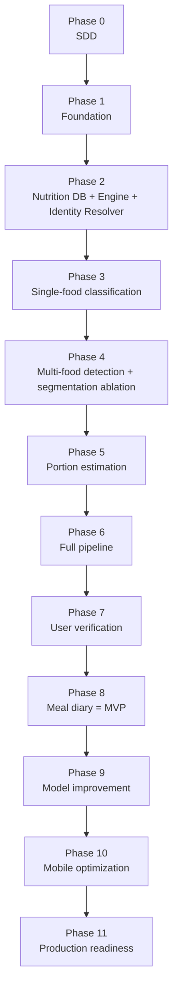

## 34.2 Parallelizable work (with explicit dependencies)

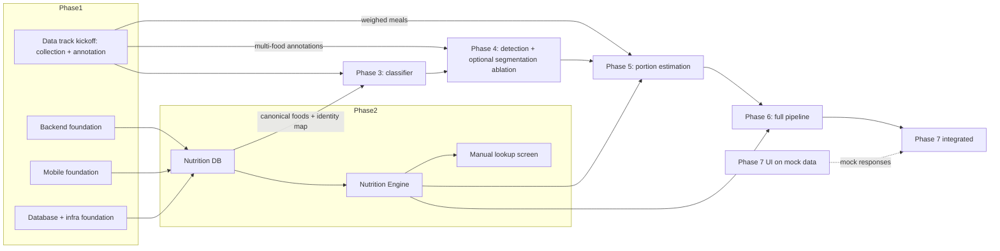

| Parallel stream | Can run alongside | Hard dependency |
|---|---|---|
| Data collection/annotation (all types) | Phases 1-5 | Annotation guidelines (Phase 0), label set (Phase 2) |
| Mobile UI for Verification (Phase 7) | Phases 5-6 using mock JSON | Final integration needs Phase 6 API |
| Detector training | Late Phase 3 (needs only box data) | Integration needs Phase 3 classifier |
| Portion data protocol + weighed collection | Phase 3-4 | Needs masks for model dev (Phase 4) |
| Security/observability groundwork | Throughout | Production hardening needs Phase 8+ |
| Model-optimization experiments | Prototyped after Phase 6 | Final decision needs Phase 9 stable models |

## 34.3 Critical path
Phase 0 -> 1 -> 2 (label set) -> 3 -> 4 -> 5 -> 6 -> 7 -> 8. **The long-lead item is data** (especially multi-food annotations and weighed portions); starting the data track in Phase 1 is mandatory to avoid idle time.

---

# 35. Phase Completion Criteria and Phase Gates

## 35.1 Required phase-end report (for every phase) **[CONFIRMED]**

```text
What was built
What was tested
What is working
What remains
What artifacts were produced
What is required before starting the next phase
```

## 35.2 Phase Gates

```text
PHASE 0 GATE
[ ] SDD reviewed by ML, backend, mobile, nutrition and legal/privacy
[ ] Open questions triaged, owners assigned
[ ] Visual label set v0, identity map v0 (sizes TBV) and annotation guide v0 approved
[ ] Dataset/model licensing audit complete
[ ] OpenAPI draft and ERD approved
Only then -> Phase 1

PHASE 1 GATE
[ ] One-command local environment
[ ] Auth works on Android and iOS
[ ] CI green (lint, tests, build)
[ ] Structured logging + error envelope in place
[ ] Dev environment deployed
[ ] Documentation updated
Only then -> Phase 2

PHASE 2 GATE
[ ] Seeded canonical foods for the Phase-2 set (energy + macros 100%)
[ ] Identity map v1 + resolver tested (coverage, weights, alias, golden mapping tests)
[ ] Provenance recorded for every nutrient value
[ ] Unit conversion tested (property + golden tests)
[ ] Nutritionist sign-off on top-100 dishes
[ ] Search/calculate APIs pass negative tests
[ ] Micro coverage report published
Only then -> Phase 3

PHASE 3 GATE
[ ] Model trained, reproducible from one command
[ ] Validation completed
[ ] Frozen test dataset evaluated, metrics recorded (Top-1/3, P/R/F1, ECE) per slice (Section 26.6)
[ ] Resolver wired to classifier: visual class -> canonical food verified end-to-end
[ ] Leakage audit passed
[ ] Failure cases analyzed (confusion pairs)
[ ] ONNX export parity verified; latency measured
[ ] API integration tested; model card written
[ ] Documentation updated
Only then -> Phase 4

PHASE 4 GATE
[ ] Detector trained and registered
[ ] Segmentation ablation completed (detection-only vs detection+segmentation); adoption decision recorded (ADR-010)
[ ] mAP / major-item recall meet dev targets (mask IoU only if segmentation adopted)
[ ] Thali and overlap slices reported
[ ] Fallbacks (zero/merged detections) tested
[ ] Multi-item API tested end-to-end
Only then -> Phase 5

PHASE 5 GATE
[ ] Weighed-meal benchmark built and frozen
[ ] MAE/RMSE/MAPE/MdAPE reported per food type
[ ] Method decision recorded (ADR-008) with ablations
[ ] Limitations documented
[ ] Defaults/fallbacks tested
Only then -> Phase 6

PHASE 6 GATE
[ ] Full pipeline works through the mobile app
[ ] Meal-level success rate measured on benchmark
[ ] All Section 27 error paths verified
[ ] Latency meets dev targets
[ ] Internal dogfooding feedback triaged
Only then -> Phase 7

PHASE 7 GATE
[ ] FR-C1..C9 verified
[ ] Local/server recalculation parity proven
[ ] Correction events stored with model versions
[ ] Time-to-correct measured
Only then -> Phase 8

PHASE 8 GATE (MVP GATE)
[ ] Full E2E: photo -> analyze -> verify -> correct -> save -> daily total updated
[ ] Offline/sync scenarios pass
[ ] UAT with realistic Indian meals meets thresholds
[ ] MVP checklist (Section 36) complete
Only then -> Phase 9 (limited beta may start)

PHASE 9 GATE
[ ] One full improvement cycle completed
[ ] Frozen-test improvement, no slice regression
[ ] Shadow/A-B run and rollback drill done
[ ] Consent and privacy checks in feedback pipeline verified
Only then -> Phase 10

PHASE 10 GATE
[ ] Section 29 MVP targets met
[ ] Cloud/on-device/hybrid decision documented with data
[ ] Quantization accuracy loss within budget
[ ] Battery/network benchmarks recorded
Only then -> Phase 11

PHASE 11 GATE (LAUNCH GATE)
[ ] Pen test findings remediated
[ ] Rate limiting, monitoring, alerts, crash reporting live
[ ] Backups restored successfully in drill
[ ] Account + image deletion verified end-to-end
[ ] Legal/privacy sign-off
[ ] Go/No-Go review passed
Only then -> Public launch
```

---

# 36. MVP Definition

**MVP = end of Phase 8** (plus the minimum hardening of Phase 11 for any external beta).

| MVP capability | Included |
|---|---|
| Android and iOS app | Yes |
| Food image input (camera + gallery) | Yes |
| Indian food recognition (small, high-quality, representative label set; size TBV and data-driven, expanded iteratively) | Yes |
| Multi-food detection (plates, thali compartments) | Yes |
| **Food Identity Resolution** (visual class -> canonical food + variant) | Yes |
| Basic portion estimation with range and confidence | Yes |
| Calories + macros + selected micros (calcium, iron, potassium, vit A, vit C, B12, folate where data exists) | Yes |
| Confidence display | Yes |
| User correction (food, add/remove, quantity, unit, **variant where applicable**) + recalculation | Yes |
| Meal saving with meal type | Yes |
| Daily summary + history | Yes |
| Manual food search/log fallback | Yes |
| Basic profile + authentication | Yes |

**MVP quality bar:** MVP column of Section 26.2 and Section 29.1, plus UAT exit criteria (Section 30.5).

**MVP exclusions:** segmentation is not an MVP requirement unless the Phase 4 ablation adopts it; MLflow, DVC, Redis, TensorRT and async queues are optional (Section 32.1).

**Post-MVP:** Phases 9-11 hardening; everything in Section 37 flagged Future (items A-N); goals/targets, recommendations, coaching, social, wearables, barcode, voice, menu recognition, Hindi UI, variant selector UI, per-user personalization.

---

# 37. Future Roadmap

**[FUTURE] - documented only; not implemented in core phases; revisit only after the recognition pipeline meets production targets.** Scope-control principle (3.3): *do not build advanced intelligence on top of an unreliable food-recognition and portion-estimation foundation.*

## 37.1 Version roadmap (version allocation is TBV)

| Version | Scope |
|---|---|
| **V1 / MVP** | Reliable food recognition + Food Identity Resolution + portion estimation with uncertainty + nutrition calculation + user verification/correction (food, quantity, variant) + meal logging + daily nutrition summary + manual search/log fallback + basic profile/authentication. Android + iOS. |
| **V2** [NEXT VERSION] | Personalized calorie/macronutrient targets + adaptive nutrition + meal recommendations + basic AI nutrition assistance |
| **V3+** [POST-MVP] | Advanced health intelligence, wearable integration, grocery/recipe intelligence, restaurant/menu intelligence, voice logging, advanced personalization, advanced computer vision, regional language intelligence |

## 37.2 Deferred feature register (none is an MVP requirement)

| ID | Deferred feature group | Items | Tag |
|---|---|---|---|
| A | Personalized nutrition targets | dynamic calorie targets; personalized macro targets; adaptive targets from behavior; goal-specific optimization | [NEXT VERSION] (V2) |
| B | AI diet coach / conversational assistant | natural-language nutrition conversations; personalized advice; context-aware coaching; continuous conversational guidance | [NEXT VERSION] basic assistance (V2); advanced [POST-MVP] |
| C | Personalized meal recommendations | "What should I eat today?"; "What should I avoid?"; AI meal recommendations; meal planning | [NEXT VERSION] (V2) |
| D | Advanced health insights | long-term trends; behavioral analysis; weight/nutrition correlation; personalized insights | [POST-MVP] |
| E | Grocery intelligence | auto grocery lists; ingredient planning; grocery recommendations | [POST-MVP] |
| F | AI recipe generation | personalized and nutrition-constrained recipes; ingredient substitutions | [POST-MVP] |
| G | Fitness and wearable integration | smartwatch/tracker integration; exercise/calorie-burn sync; health-platform integrations | [POST-MVP] |
| H | Restaurant/menu intelligence | menu recognition; restaurant-specific nutrition; menu-photo analysis | [POST-MVP] |
| I | Barcode and packaged food | barcode scanning; packaged-food lookup; nutrition-label OCR | [POST-MVP] |
| J | Voice-based food logging | voice meal entry; conversational logging | [POST-MVP] |
| K | Advanced user personalization | user-specific recognition adaptation; personalized models; user-specific correction learning | [POST-MVP] |
| L | Advanced computer vision | depth/LiDAR-assisted portion; 3D reconstruction; multi-view analysis | [POST-MVP] / [TBV] |
| M | Regional language support | Hindi/regional UI; multilingual food input; multilingual assistance | [POST-MVP] (alias table already supports language tags) |
| N | Hidden-ingredient / recipe reasoning | hidden-ingredient inference; recipe-level reconstruction; probabilistic preparation reasoning beyond what the image supports | [FUTURE] |

## 37.3 Extension points preserved in the V1 architecture
Nutrition Engine API, Food Identity Resolver (context hook for user history), versioned models/maps/DB, correction event log, `food_variant`/`recipe` entities, and the inference adapter. The detailed notes below predate the register and remain valid.


| Feature | Notes / prerequisites |
|---|---|
| Personalized calorie/macro targets | Needs validated profile data and medical-safety review |
| Weight-loss/gain goals | Builds on stable diary data |
| AI diet recommendations / meal recommendations / "What should I eat?" | Requires reliable nutrition data + user preference modeling; safety guardrails |
| Grocery recommendations | Depends on meal planning |
| Recipe generation / ingredient understanding | Recipe-aware nutrition (Recipe entities already in schema) |
| Health insights | Needs longitudinal data; careful non-medical framing |
| Fitness integration, wearables | HealthKit / Health Connect integrations |
| Barcode scanning | Packaged-food DB (OpenFoodFacts, local) |
| Restaurant menu recognition | OCR + menu DB |
| Voice logging | ASR + same Nutrition Engine |
| Conversational nutrition assistant / personalized AI coach | LLM layer using Nutrition Engine as the source of truth (tool calling), never free-form numbers |
| Per-user recognition personalization | Re-ranking priors on top of frozen models |
| Metric depth / LiDAR / AR measurement | Device-dependent portion boost |
| Regional language UI and food names | Alias table already supports languages |
| Variant selector (home vs restaurant, oil level) | Uses `food_variant` (already modeled) |
| Hidden-ingredient reasoning (oil/ghee questions) | Ask-user prompts to narrow recipe uncertainty |

**Architectural guarantee:** each of these plugs into existing seams (Nutrition Engine API, versioned models, event logs) without rewriting core modules.

---

# 38. Risks and Mitigation

| # | Risk | Likelihood | Impact | Mitigation |
|---|---|---|---|---|
| R1 | **Insufficient high-quality Indian food data** | High | High | Start data track Phase 1; own capture program; contributors; pre-labeling; group-aware splits; start with a smaller label set |
| R2 | Portion error too large to be useful | High | High | Hybrid approach; countable-item logic; confidence ranges; cheap correction UX; honest messaging; Phase 5 gate |
| R3 | Visually similar dishes confuse classifier | High | Med | Hierarchical outputs, merged visual classes, Top-3 UI, targeted hard-negative data |
| R4 | Nutrition data gaps / licensing | Med | High | Source priority, recipe-calculated profiles, nutritionist review, early licensing audit, "missing" semantics |
| R5 | Recipe variability makes "exact" calories impossible | Certain | Med | Ranges, variants, estimate language, user correction |
| R6 | User distrust from wrong results | Med | High | Calibrated confidence, transparent UI, fast corrections, disclaimers |
| R7 | GPU cost/latency at scale | Med | Med | ONNX/TensorRT, batching, autoscaling, hybrid inference (Phase 10) |
| R8 | Model/dataset licensing (e.g., AGPL detector, dataset terms) | Med | High | License audit in Phase 0; prefer permissive models; legal review |
| R9 | Feedback poisoning / label noise | Med | Med | Review pipeline, trust scores, frozen golden test set |
| R10 | Privacy/regulatory non-compliance (DPDP, store policies) | Med | High | Privacy-by-design, consent flows, retention, legal review, Phase 11 gate |
| R11 | Scope creep into personalization/coaching | High | Med | Non-goals enforced; phase gates; change-request process |
| R12 | On-device model accuracy loss/complexity | Med | Med | Cloud-first V1; evaluate in Phase 10 with accuracy budget |
| R13 | Distribution shift after launch (new devices, dishes, seasons) | Med | Med | Drift monitoring, hard-example mining, class-addition process |
| R14 | Team skill gaps (ML ops, Flutter+ML) | Med | Med | Managed services where possible; MLflow/DVC simple setups; pair on first cycle |
| R15 | Health-claim liability | Low-Med | High | Not medical advice; estimate language; avoid health claims; legal review |
| R16 | Single-vendor/API dependencies (auth, cloud) | Low | Med | Abstraction layers, IaC, portable formats |
| R17 | Benchmark overfitting (tuning on test) | Med | Med | Frozen test, rotating challenge set, separate tuning sets |
| R18 | Identity-map errors or ambiguous visual-to-canonical mapping | Med | High | Curated weights, golden mapping tests, variant chips, correction routing (23.5), versioned maps |
| R19 | Segmentation adds complexity without measurable benefit | Med | Med | Detection-only baseline; Phase 4 ablation; ADR-010 decision |
| R20 | Over-expanding the class set before labels and nutrition mapping are reliable | Med | High | Data-driven taxonomy growth (24.7); per-slice gates; release rule that every class has a mapped profile |
| R21 | Premature infrastructure (MLflow/DVC/Redis/TensorRT/queues) adds operational cost | Med | Med | Introduction criteria (32.1); interim lightweight practices |
| R22 | Aggregate accuracy hides weak slices | Med | High | Mandatory slice reporting and per-slice floors (26.6) |
| R23 | Advanced features creep into MVP | High | Med | Scope-control principle (3.3); deferred register (37.2); phase gates |

---

# 39. Open Technical Questions

| ID | Question | Owner | Needed by |
|---|---|---|---|
| OQ-1 | Initial visual labelset: how many classes (TBV, data-driven), which foods, and which merge into shared visual classes? | ML lead + nutritionist | Phase 2 |
| OQ-2 | Detector licensing: Ultralytics YOLO (AGPL/enterprise) vs permissive alternatives (RT-DETR, YOLOX)? | ML lead + legal | Phase 0/4 |
| OQ-3 | IFCT 2017 usage rights; any restrictions for commercial app use? | Legal + data | Phase 0/2 |
| OQ-4 | Public Indian-food datasets: licenses and label quality? | ML lead | Phase 0/3 |
| OQ-5 | Is segmentation adopted at all (Phase 4 ablation), and if so which approach (SAM-family, YOLO-seg, Mask2Former)? | ML | Phase 4 (TBV) |
| OQ-6 | CNN vs ViT classifier (ADR-004) result | ML | Phase 3 (TBV) |
| OQ-7 | Which portion method wins (ADR-008)? Is monocular depth worth it? | ML | Phase 5 (TBV) |
| OQ-8 | Standard plate/bowl/katori sizes to assume; do we ask users to choose katori size? | Product + nutritionist | Phase 5 |
| OQ-9 | Guest mode allowed? | Product | Phase 1 |
| OQ-10 | Managed auth (Firebase/Auth0/Supabase) vs self-built JWT? | Backend | Phase 1 |
| OQ-11 | Image retention default (transient days; "don't store my photos" option)? | Product + legal | Phase 6/11 |
| OQ-12 | Hosting cloud + container platform (Cloud Run/ECS/K8s) and GPU provider? | Infra | Phase 1/6 |
| OQ-13 | When to adopt MLflow (vs lightweight tracking) and whether W&B is needed at all? Self-host vs hosted? | ML ops | Phase 3-9 |
| OQ-14 | State management (BLoC vs Riverpod)? | Mobile lead | Phase 1 |
| OQ-15 | Variants (home vs restaurant): ship selector in MVP? | Product + nutritionist | Phase 2 |
| OQ-16 | Confidence thresholds (high/medium/low) values | ML + UX | Phase 6 |
| OQ-17 | Minimum user age and age-gate policy | Legal | Phase 0/11 |
| OQ-18 | Target regions/languages beyond English at launch | Product | Phase 0 |
| OQ-19 | Whether `Paneer Makhani` etc. are aliases or separate foods (alias governance policy) | Nutritionist + ML | Phase 2 |
| OQ-20 | Acceptable calorie error bound communicated to users (messaging) | Product + legal | Phase 6 |
| OQ-21 | Identity-map governance: who approves weights/default variants, and how are map changes reviewed? | Nutritionist + ML | Phase 2 |
| OQ-22 | Segmentation adoption thresholds (minimum measured benefit vs added latency/cost) | ML | Phase 4 |
| OQ-23 | Per-slice release floors and minimum slice sample sizes | ML + product | Phase 3 |
| OQ-24 | Default-variant policy when preparation is not inferable (home-style vs restaurant-style) | Nutritionist + product | Phase 2 |

---

# 40. Final Implementation Guidelines

1. **Contract-first.** Keep OpenAPI, Pydantic models and Dart DTOs generated from one source; breaking changes require a version bump.
2. **Interfaces before models.** Implement `Detector/Segmenter/FoodClassifier/PortionEstimator` interfaces with simple baselines/stubs early; real models plug in later.
3. **Nutrition engine isolation.** No vision imports in nutrition code. No nutrition lookups inside model code.
4. **Never trust the client for totals.** Recompute server-side; snapshot at save.
5. **Version everything.** `visual_labelset_version`, `identity_map_version`, `model_version`, `nutrition_db_version`, `dataset_version`, `schema_version`; store in every analysis/meal.
6. **Estimates, not measurements.** UI language, ranges and confidence everywhere; never display uncalibrated percentages as certainty.
7. **Missing is not zero.** Availability flags propagate end-to-end.
8. **Frozen test set discipline.** No tuning on it; feedback data never enters it.
9. **No auto-training on raw user data.** Always collection -> validation -> cleaning -> review -> dataset -> training -> evaluation -> deployment.
10. **Feature flags** for anything partially built; a flag must never mean "implemented in the wrong phase".
11. **Observability from day one:** request IDs, per-stage timings, model versions in logs.
12. **Privacy defaults:** training use is opt-in, images expire, deletion is real and verified.
13. **Reproducibility:** one-command environment, one-command training, pinned dependencies and seeds.
14. **Decision hygiene:** every TBV closes with an ADR containing evidence; update this SDD (changelog at top).
15. **Definition of Done (per task):** code + tests + docs + migration + telemetry + review.
16. **Phase discipline:** if a requirement from a later phase seems necessary, raise a change request; do not slip it in.
17. **Identity layer.** The classifier outputs visual classes only; every nutrition lookup goes through the Food Identity Resolver. Never use a visual class ID as a `food_id`.
18. **Scope control.** Do not build advanced intelligence on top of an unreliable food-recognition and portion-estimation foundation. Deferred features (Section 37.2) require a change request and an approved SDD revision.
19. **Evidence before complexity.** Segmentation, MLflow, DVC, Redis, TensorRT and async queues are adopted only when measurements justify them (Section 32.1).
20. **No blanket accuracy claims.** Report recognition, detection, portion, nutrition and meal-level metrics separately and per slice.

---

# Appendix A: Architectural Decision Records

## ADR-001: Flutter vs Native Android/iOS
- **Problem:** Need Android + iOS with camera, local DB, API, and possible future on-device ML.
- **Options:** (A) Flutter, (B) Native Kotlin + Swift, (C) React Native, (D) Kotlin Multiplatform.
- **Decision (Proposed):** **Flutter**.
- **Reasoning:** One codebase and team, fast UI iteration, strong camera/image ecosystem, adequate performance for a form-and-camera app, ML inference initially server-side so native ML access is not on the critical path.
- **Trade-offs:** Platform channels/FFI needed for TFLite/Core ML; camera plugin quirks; larger app size than minimal native.
- **Consequences:** Phase 10 may implement inference via native modules behind a Dart interface; if on-device ML proves too painful, only that module goes native. Revisit if Phase 10 benchmarks show unacceptable camera/ML integration cost.

## ADR-002: FastAPI vs alternative backend
- **Problem:** Backend that integrates tightly with Python ML and exposes typed REST APIs.
- **Options:** (A) FastAPI, (B) Django REST Framework, (C) Flask, (D) Node.js/NestJS, (E) Go.
- **Decision:** **FastAPI** (modular monolith).
- **Reasoning:** Python-native ML integration, Pydantic validation, auto OpenAPI, async I/O for uploads, light footprint.
- **Trade-offs:** No built-in admin/ORM (use SQLAlchemy; build reviewer tool separately); async/CPU-bound inference needs worker separation.
- **Consequences:** Inference executed in a separate worker/process or thread pool; ORM and migration choices explicit; admin tooling built or bought later.

## ADR-003: Cloud vs on-device inference
- **Problem:** Where models run affects accuracy, latency, cost, privacy, offline use, and complexity.
- **Options:** (A) Cloud only, (B) On-device only, (C) Hybrid.
- **Decision:** **Cloud for V1 (Phases 3-9); final decision in Phase 10 using measurements; hybrid is the leading end-state candidate (TBV).**
- **Reasoning:** Large models and rapid iteration are far easier on servers; quantization risks accuracy; one runtime to maintain; instant model updates without app releases.
- **Trade-offs:** GPU cost, network latency, privacy concern for image upload, no offline scan.
- **Consequences:** Models exported to ONNX from the start (portable); interfaces allow swapping the runtime; privacy mitigations (retention, consent) are mandatory.

## ADR-004: CNN vs Vision Transformer classifier
- **Problem:** Choose backbone for fine-grained Indian-food classification balancing accuracy, calibration, latency, exportability.
- **Options:** (A) EfficientNetV2/ConvNeXt (CNN), (B) ViT/Swin/DINOv2 fine-tune, (C) CLIP linear-probe/zero-shot.
- **Decision:** **TBV in Phase 3 bake-off; default to the best of A/B at equal latency budget; CLIP used for embeddings/OOD/pre-labeling, not as sole classifier.**
- **Reasoning:** ViTs with strong pretraining often win in fine-grained/low-data regimes; CNNs are cheaper, quantize better, and easier on mobile. Evidence needed on our data.
- **Trade-offs:** ViT: heavier, harder to quantize; CNN: may plateau on fine-grained classes.
- **Consequences:** Training harness is backbone-agnostic (`timm`); a distilled CNN student may serve mobile later regardless of the server winner.

## ADR-005: Detection + classification vs end-to-end model
- **Problem:** Single model (image -> dish/calories) vs cascade.
- **Options:** (A) End-to-end calorie regression, (B) Detector with fine dish classes, (C) **Detector (coarse) [+ optional segmentation] + classifier + Food Identity Resolution + portion + nutrition DB**.
- **Decision:** **C.**
- **Reasoning:** Separation gives attributable errors, independent evaluation, replaceable modules, DB-driven nutrition (updatable without retraining), and fits the correction UX. Detector with hundreds of fine classes is data-hungry and brittle; end-to-end calorie labels are unavailable at scale.
- **Trade-offs:** Error propagation across stages; higher latency/complexity; more models to maintain.
- **Consequences:** Stage-wise metrics and confidence propagation; pipeline orchestrator is a first-class component; end-to-end meal-level benchmark guards against local optimization.

## ADR-006: PostgreSQL vs NoSQL
- **Problem:** Storage for users, meals, foods, nutrition, ML records.
- **Options:** (A) PostgreSQL (+JSONB), (B) MongoDB/Firestore, (C) Hybrid.
- **Decision:** **PostgreSQL.**
- **Reasoning:** Strong relational structure (meals<->items<->foods), transactions, aggregation queries (daily totals), constraints for data quality, `pg_trgm` for search, JSONB for flexible micronutrients and ML payloads.
- **Trade-offs:** Schema migrations needed; horizontal scaling more work (not a V1 concern).
- **Consequences:** Alembic migrations per phase; large blobs stay in object storage; analytics may move to a warehouse later.

## ADR-007: Nutrition data source strategy
- **Problem:** Reliable, legally usable nutrient data for Indian dishes, including micros.
- **Options:** (A) Single source (IFCT), (B) USDA only, (C) Crowdsourced/user data, (D) **Layered curated sources with provenance + recipe-based calculation + nutritionist review**.
- **Decision:** **D** (priority: IFCT -> USDA -> recipe-calculated -> reviewed estimates).
- **Reasoning:** No single source covers cooked Indian dishes with micros; provenance enables trust and updates; recipe calculation fills gaps transparently.
- **Trade-offs:** Curation effort and professional review cost; mixed data quality.
- **Consequences:** `nutrition_source`, `method`, `reviewed_by` mandatory; availability flags; licensing checks (OQ-3); versioned DB releases.

## ADR-008: Portion estimation methodology
- **Problem:** Grams from a single RGB image are inherently uncertain.
- **Options:** (A) Mask area only, (B) Plate/bowl-scale priors, (C) Monocular depth, (D) Learned regressor, (E) Reference object required, (F) **Hybrid of B+D with countable-item logic, optional depth, and mandatory user-correction path**.
- **Decision:** **F as hypothesis (TBV in Phase 5 via ablations); no mandatory reference object; depth only if it demonstrably reduces error.**
- **Reasoning:** Countable foods are accurately estimated by counting; bowl foods by bowl-fill logic; heaps are inherently uncertain -> range + user correction. Requiring a reference object harms UX.
- **Trade-offs:** More engineering and data collection; complexity in per-type logic.
- **Consequences:** Portion module outputs ranges and method names; benchmark per food type; limitations stated to users; future LiDAR path stays open.

## ADR-009: Food Identity Resolution layer
- **Problem:** Coupling classifier labels directly to nutrition records forces retraining whenever nutrition taxonomy changes and cannot express many-to-one/one-to-many relationships (naming variants, preparation variants).
- **Options:** (A) classifier labels = `food_id`; (B) classifier labels + alias table only; (C) **separate versioned visual labelset + identity map + resolver**.
- **Decision (Proposed):** **C.**
- **Reasoning:** Separates what the model sees from what the nutrition DB considers canonical; supports candidates and variants with explicit uncertainty; lets nutrition records and maps evolve without retraining.
- **Trade-offs:** One more module, map curation effort, extra versioning.
- **Consequences:** `visual_class`, `visual_class_mapping`, `identity_map_version` tables; resolver built in Phase 2 and tested without AI; classifier never selects the nutrition entry; corrections routed by cause (23.5).

## ADR-010: Segmentation optional until evidenced
- **Problem:** Segmentation adds labeling cost, latency and complexity; its benefit for Indian plates/thalis and portion estimation is unproven.
- **Options:** (A) mandatory segmentation; (B) detection-only; (C) **detection-only baseline with segmentation as an experimental option**.
- **Decision:** **C; adoption decided by the Phase 4 ablation (TBV).**
- **Reasoning:** Compare detection-only vs detection+segmentation on detection recall, item-separation accuracy, mask IoU, portion error, latency and compute cost; adopt only if the benefit is sufficient.
- **Trade-offs:** Possible lower portion accuracy if masks turn out to matter; ablation effort.
- **Consequences:** Interfaces treat masks as optional (`mask = null`); portion estimator supports box-based regions; segmentation becomes a production dependency only after the recorded decision.

## ADR-011: Data-driven, versioned initial taxonomy
- **Problem:** A large fixed class count (e.g., 150-300) risks poor labels, unreliable nutrition mapping and unrepresentative coverage.
- **Options:** (A) large initial class set; (B) **small high-quality set expanded iteratively**; (C) hierarchical coarse-only set.
- **Decision:** **B** (size TBV), with hierarchical groups as fallback.
- **Reasoning:** High-quality labels + reliable nutrition mapping + representative coverage beat maximum class count; expansion guided by usage, errors, corrections, data and nutrition quality.
- **Trade-offs:** Lower initial coverage; more manual-search fallback early.
- **Consequences:** Independent versioning of visual labelset, identity map and nutrition DB; class-addition process (24.6/24.7); per-slice regression checks on each expansion.

---

# Appendix B: Implementation Order

**Build in exactly this order. Each step lists what must exist first.**

| Order | Build | Depends on | Why this order |
|---|---|---|---|
| **1** | **Phase 0:** approve SDD, label set v0, licensing audit, data plan | Nothing | Prevents expensive wrong turns; starts long-lead data work |
| **2** | **Phase 1:** repo, Flutter shell, FastAPI, Postgres, auth, CI, logging (**+ start data track in parallel**) | Phase 0 | Every later feature needs this skeleton |
| **3** | **Phase 2:** nutrition DB + serving units + calculation engine + **identity map + Food Identity Resolver** + manual lookup (**testable with no AI**) | Phase 1 | Defines the label set and the numeric backbone; also the manual fallback |
| **4** | **Phase 3:** single-food classifier + training/eval/versioning workflow | Phase 2 (canonical foods + identity map), data track | Proves core recognition; creates ML infrastructure reused later |
| **5** | **Phase 4:** multi-food detection + per-item classification + **segmentation ablation (optional)** | Phase 3 | Real meals have multiple items; regions needed for portions; segmentation adopted only if evidence supports it |
| **6** | **Phase 5:** portion estimation + weighed-meal benchmark | Phase 4 regions (masks if adopted), Phase 2 resolver and priors | Hardest problem; must be measured independently before integration |
| **7** | **Phase 6:** full pipeline `/food/analyze` + result screen | Phases 2-5 | First usable AI scanner; reveals true end-to-end quality |
| **8** | **Phase 7:** verification/correction flow + correction capture | Phase 6 (UI can start earlier on mocks) | Turns uncertain predictions into trustworthy data |
| **9** | **Phase 8:** meal diary + daily summary -> **MVP** | Phase 7 | Persists verified meals; completes the user value loop |
| **10** | **Phase 9:** feedback -> review -> retrain -> A/B -> deploy | Phases 7-8 data | Controlled continuous improvement |
| **11** | **Phase 10:** latency/size/battery optimization; cloud vs on-device vs hybrid decision | Phases 6, 9 | Optimize only after quality and workflow are stable |
| **12** | **Phase 11:** security, privacy, monitoring, backups, hardening, production launch | Phase 8 (min), 9-10 (recommended) | Safe public release |

**Dependency chain in one line:**
`0 -> 1 -> 2 -> 3 -> 4 -> 5 -> 6 -> 7 -> 8 (MVP) -> 9 -> 10 -> 11 (Launch)`, with the **data track** running in parallel from Phase 1 and **Phase 7 UI** allowed to start on mocked data during Phases 5-6.

---

*End of document.*
